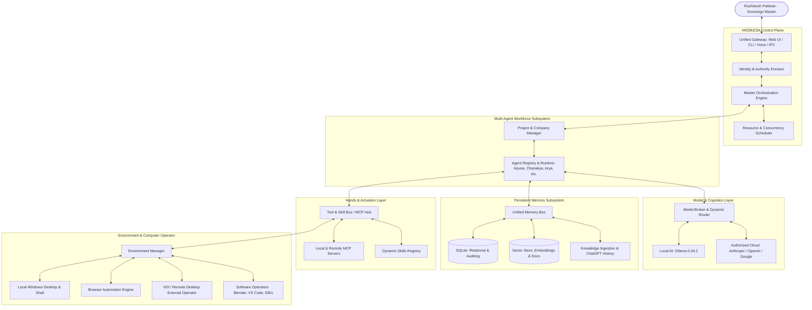

# HṚṢĪKEŚA (हृषीकेश) — System Architecture

> **International Filesystem / ASCII Alias:** `HRISEKESA`  
> **Status:** Phase 1 — Architecture & Foundation  
> **Creator & Sole Master:** Rushikesh Pattiwar  
> **Primary Development IDE:** Antigravity  

---

## 1. System Overview

**HṚṢĪKEŚA** (हृषीकेश — *The Master of the Senses, The Orchestrator*) is a sovereign personal AI operating system and autonomous AI workforce designed exclusively for its creator, Rushikesh Pattiwar.

HṚṢĪKEŚA is **not** a new foundation model. It is an orchestration, cognition, and execution control plane that transforms raw language models into an integrated personal workforce capable of operating computer environments, software tools, and autonomous multi-agent missions.

### Core Philosophy

The design of HṚṢĪKEŚA is governed by a strict biological and computational analogy:

```
┌────────────────────────────────────────────────────────┐
│                        BRAIN                           │
│     LLMs / Reasoning Models (Local & Cloud Tier)        │
└──────────────────────────┬─────────────────────────────┘
                           │ Intent & Cognition
┌──────────────────────────▼─────────────────────────────┐
│                    NERVOUS SYSTEM                      │
│             HṚṢĪKEŚA Agent Runtime Core                │
│    (Task Routing, Event Bus, Governance, Scheduling)   │
└──────┬───────────────────┬───────────────────┬─────────┘
       │ Knowledge         │ Actions           │ Perception
┌──────▼──────┐     ┌──────▼──────┐     ┌──────▼─────────┐
│   MEMORY    │     │    HANDS    │     │     WORLD      │
│ Long-Term   │     │ Tools / MCP │     │ Operating Env  │
│ Multi-Tier  │     │ Skills / API│     │ Desktop / VDI  │
│ Persistence │     │ Automation  │     │ Browser / Shell│
└─────────────┘     └─────────────┘     └────────────────┘
```

- **LLM = Brain:** The reasoning, planning, and language comprehension engine.
- **Tools = Hands:** The actuators that execute actions (MCP servers, scripts, APIs, CLI commands).
- **Memory = Long-Term Knowledge:** The persistent, structured, auditable cognitive state across sessions and projects.
- **Agent Runtime = Nervous System:** The reactive, event-driven orchestration core coordinating thoughts and actions.
- **Computer / Environment = World:** The operational environment (Windows desktop, browsers, terminals, VDIs, filesystems).
- **HṚṢĪKEŚA = The Control Plane:** The sovereign master orchestrator binding all subsystems into a unified workforce.

---

## 2. Component Architecture

The HṚṢĪKEŚA architecture is organized into eight decoupled, modular layers:



---

## 3. Module Boundaries

To ensure zero vendor lock-in, maintainability, and clear separation of concerns, all inter-module communication is mediated through strictly typed contracts:

| Module | Boundary & Responsibility | Explicit Non-Responsibilities |
| :--- | :--- | :--- |
| `core/identity` | Rushikesh authority validation, cryptographic signatures, human-in-the-loop (HITL) gates | Executing tools, prompt engineering |
| `core/orchestrator` | High-level goal decomposition, DAG generation, state machine | Direct OS calls, model API calls |
| `core/scheduler` | Memory, CPU, token budget enforcement, priority queues | Task planning, agent logic |
| `agents/` | Role execution, scratchpad management, inter-agent messaging | Direct hardware or OS interaction |
| `models/` | Normalizing prompts, completions, streaming, tool definitions | Deciding *which* task to run |
| `memory/` | Storing, indexing, and querying multi-tier state and documents | Business logic, direct tool invocation |
| `tools/` | MCP client/server management, sandboxed execution, verification | Persisting long-term agent state |
| `environments/` | Abstraction for Windows, terminal, browser, and remote VDI | Planning how applications are used |

---

## 4. Proposed Technology Choices

### Target Hardware Profile
- **Machine:** Acer Swift SFG14-73T
- **Processor:** Intel Core Ultra 5 125H (14 cores / 18 threads: 4 P-cores, 8 E-cores, 2 LP E-cores, integrated Intel AI Boost NPU)
- **RAM:** 15.7 GB (~16 GB LPDDR5X)
- **Graphics:** Intel Arc Graphics (integrated, ~2 GB allocated pool, dynamic shared system memory)
- **Host OS:** Windows 11 (64-bit)

### Language & Runtime Strategy
1. **Orchestration & Gateway Layer (Node.js 24 + TypeScript):**
   - *Rationale:* Event-driven I/O, ultra-low idle memory footprint (<80 MB), native MCP SDK support, rich asynchronous stream processing, and seamless desktop UI integration (Fastify / Vite / Electron / Tauri).
2. **Environment & Native Computation Worker (Python 3.14):**
   - *Rationale:* Automation scripting, PyAutoGUI, OpenCV, Windows UI Automation bindings, Blender Python headless scripting, and scientific data manipulation.
3. **Database & Storage (SQLite with WAL mode + sqlite-vec):**
   - *Rationale:* Embedded zero-cost, zero-maintenance storage. Consumes under 10 MB RAM, completely avoiding resource-heavy PostgreSQL or Docker daemons on a 16 GB laptop.

---

## 5. Local vs. Cloud Architecture

HṚṢĪKEŚA employs a **Local-First, Cloud-Burst** hybrid model:

```
                      [ Incoming Task / Objective ]
                                    │
                       Complexity & Privacy Triage
                                    │
             ┌──────────────────────┴──────────────────────┐
             ▼                                             ▼
     [ Local Tier (Ollama) ]                      [ Cloud Burst Tier ]
  - 3B to 7B Quantized Models                  - Frontier Models (Claude, GPT, Gemini)
  - Zero-cost, 100% private                    - Complex reasoning & deep architecture
  - Classification, triage, quick tool calls   - Code synthesis & multi-modal inspection
  - Offline autonomous execution               - Pay-per-use, authorized API keys
             │                                             │
             └──────────────────────┬──────────────────────┘
                                    ▼
                         [ Action & Verification ]
```

### Local Tier Specification (Ollama 0.34.2)
- Target sizes: 3B to 7B parameter models (e.g., Llama 3.2 3B, Qwen 2.5 7B Q4_K_M).
- Memory footprint: ~2.5 GB to 5.0 GB RAM, leaving 10+ GB for the operating system, IDE, browser, and user tasks.
- Target use cases: Intent classification, short-horizon tool parameter generation, local status reporting, privacy-sensitive offline operations.

### Cloud Tier Specification
- Providers: Anthropic (Claude 3.7 Sonnet / 3.5 Sonnet), OpenAI (GPT-4o, o3-mini), Google (Gemini 2.5 Flash / Pro).
- Target use cases: Large-scale refactoring, complex research synthesis, strategic planning, high-accuracy document parsing.

---

## 6. Model Provider Abstraction

The Model Broker decouples agent logic from specific AI vendors:

```typescript
interface IModelProvider {
  id: string;
  name: string;
  isLocal: boolean;
  capabilities: {
    maxContextTokens: number;
    supportsVision: boolean;
    supportsTools: boolean;
    supportsStructuredOutput: boolean;
  };
  metrics: {
    costPerMillionInputTokens: number;
    costPerMillionOutputTokens: number;
    averageLatencyMs: number;
  };
  complete(request: CompletionRequest): Promise<CompletionResponse>;
  stream(request: CompletionRequest): AsyncIterable<StreamChunk>;
}
```

### Routing & Fallback Policies
- **Cost-Optimized Route:** Evaluates if a 7B local model can fulfill the task with >=95% confidence. If not, routes to high-efficiency cloud model (e.g., Gemini Flash or Claude Haiku).
- **Capability-Based Route:** Multimodal vision tasks route to vision-capable providers; deep coding missions route to verified frontier reasoning models.
- **Resilience Cascade:** If a cloud provider encounters rate-limits, network timeouts, or service degradation, the router seamlessly falls back through authorized secondary providers down to local Ollama.
- **Security Compliance:** Model switching is never used to circumvent vendor safety guardrails or access policies.

---

## 7. Memory Architecture

HṚṢĪKEŚA rejects the "single generic vector table" antipattern in favor of a **14-tier structured memory architecture** backed by an embedded SQLite relational foundation.

```
┌────────────────────────────────────────────────────────────────────────┐
│                        STRUCTURED MEMORY TIERS                         │
├──────────────────────────┬─────────────────────────────────────────────┤
│ 1. Core Identity         │ System sovereignty, foundational directives │
│ 2. Creator Profile       │ Rushikesh Pattiwar personal & career profile│
│ 3. Operating Principles  │ Autonomy, safety, zero-cost & VDI rules     │
│ 4. Preferences           │ Explicit communication & workflow settings  │
│ 5. Conversational/Episode│ Dialogue history & episodic milestones      │
│ 6. Project Memory        │ Per-project missions, specs, architectures  │
│ 7. Agent Memory          │ Learned agent-specific roles & heuristics   │
│ 8. Decisions             │ ADR-style log of all autonomous decisions   │
│ 9. Knowledge             │ Indexed reference materials & search index  │
│ 10. Skills               │ Discovered, verified, and configured tools  │
│ 11. Tool State           │ MCP tool connections, cache & status        │
│ 12. Task History         │ DAGs, step logs, execution statuses         │
│ 13. Documents/References │ Ingested specs, manuals, and papers         │
│ 14. Audit History        │ Provenance audit trail & security log       │
└──────────────────────────┴─────────────────────────────────────────────┘
```

### Persistence Subsystem Implementation (Phase 3B — IMPLEMENTED)

1. **Native SQLite Engine (`src/persistence/database/database.manager.ts`):**
   - Built on Node.js 24 native `node:sqlite` (`DatabaseSync`). Zero external dependencies.
   - File storage at `data/hrisekesa.db` (strictly `.gitignored`).
   - Concurrency & Reliability PRAGMAs:
     - `PRAGMA journal_mode = WAL;` (non-blocking concurrent reads)
     - `PRAGMA foreign_keys = ON;` (cascading deletes & strict referential integrity)
     - `PRAGMA synchronous = NORMAL;` (optimal speed and durability balance)
     - `PRAGMA busy_timeout = 5000;` (5-second lock resilience)

2. **Schema & Migration Ledger (`src/persistence/migrations/`):**
   - `schema_migrations` ledger ensures atomic, ordered schema upgrades.
   - `sessions`: Durable conversation threads (`id`, `title`, `status`, `created_at`, `updated_at`, `metadata`).
   - `messages`: Chronologically ordered conversation turns with strictly sequenced `ordinal` integers and `session_id` foreign keys.
   - `memory_items`: Universal structured store backing all 14 memory tiers with provenance metadata (`id`, `tier`, `key`, `content`, `source`, `provenance`, `confidence`, `created_at`, `updated_at`, `metadata`).

3. **Repository Layer (`src/persistence/repositories/`):**
   - `SessionRepository`: Thread CRUD and status tracking.
   - `MessageRepository`: Chronological and recent turn queries.
   - `MemoryRepository`: Universal structured CRUD, tier filtering, and keyword search.

4. **Context Assembler (`src/conversation/context.assembler.ts`):**
   - Assembles prompt context dynamically:
     - Sovereign identity prompt (anchored at index 0).
     - Structured creator profile summary (Rushikesh Pattiwar).
     - Relevant active memories (from explicit preferences/principles).
     - Bounded conversation sliding window (max 12 messages / 8,000 characters).

5. **ChatGPT Ingestion Subsystem (`src/memory/import/` — IMPLEMENTED):**
   - `ChatGptImporter` parses authorized ChatGPT export JSON (`conversations.json`).
   - Normalizes conversation mapping DAGs into linear threads.
   - Assigns explicit provenance tags (`source: 'chatgpt_export'`, `provenance: 'imported'`).
   - Supports dry-run validation, session persistence, and episodic memory extraction.

### Planned Memory Capabilities (Future Phases)
- **Vector Embedding Store (Phase 3C / Future):** Dedicated semantic vector index for fuzzy recall.
- **Dynamic Episodic Summarization:** Autonomous background compression of historical dialogues into milestone episodes.

---

## 8. Agent Architecture

### Organizational Hierarchy

```
                      Rushikesh Pattiwar
                     (Sole Master & Owner)
                              │
                         HṚṢĪKEŚA
               (Personal OS / Orchestrator)
                              │
               ┌──────────────┴──────────────┐
               ▼                             ▼
       Project Director              Department Head
     (e.g., Chanakya - SAHIKARA)    (e.g., Vikram - Engineering)
               │                             │
               └──────────────┬──────────────┘
                              ▼
                       Specialist Agent
                 (e.g., Arjuna - Lead Coder)
                              │
                              ▼
                         Tool Worker
                   (MCP / Sandbox Execution)
```

### Core Workforce Roster (Indian-Inspired Sovereign Identities)
Names and roles are strictly decoupled. Standard default appointments include:

| Agent Name | Historical / Philosophical Resonance | Default Specialty Domain |
| :--- | :--- | :--- |
| **Arjuna** | Peerless focus, precision execution | Lead Systems Engineer & Code Construction |
| **Chanakya** | Master strategist, political economy | Project Director, Strategy & Mission Decomposition |
| **Kautilya** | Governance, statecraft, resource allocation | Scheduler, Resource Manager & Operations |
| **Arya** | Noble, seeker of truth | Research, Architecture Review & Synthesis |
| **Vikram** | Valorous, decisive, enterprising | DevOps, Infrastructure, Tooling & Build Lead |
| **Aditi** | Boundless, cosmic guardian | Security Enclave, Compliance, Verification & Safety |
| **Karna** | Unflinching dedication, resilience | Quality Assurance, Error Recovery & Edge Testing |
| **Dhruva** | Steadfast, unshakeable | Persistent Memory, Document Ingestion & State Keeper |
| **Agastya** | Great sage, synthesizer of oceans of knowledge | Documentation, Technical Writing & Knowledge Base |
| **Varun** | Lord of oceans, cosmic order, network skies | Network, External APIs, Cloud Providers & Sync |

### Agent Lifecycle & Contract
Every agent possesses:
1. **Persistent Identifier (`uuid`):** Constant across reboots.
2. **Dynamic Role & Department:** Reconfigurable per project.
3. **Scoped Tool Permissions:** White-listed tools based on least-privilege.
4. **Working Scratchpad:** Short-term task-specific memory.
5. **Observation-Action-Verification Cycle:** No agent marks a task complete without programmatic verification.

---

## 9. Tool / Skill / MCP Architecture (Phase 4 Specification)

Tools represent the physical actuation layer ("Hands") of HṚṢĪKEŚA.

```
                    HṚṢĪKEŚA Control Plane
                              │
                         Model Router
                              │
                    Model Tool Proposal
                              │
                        Tool Registry
                              │
                     Permission Manager
                   (Workspace & Danger Tiers)
                              │
                    Human Approval Gate
                 (Required for Tiers 3 & 4)
                              │
                     Tool Execution Bus
                      /       |       \
                     /        |        \
               Built-in      MCP      Future
                 Tools      Tools     Skills
```

### 1. Vendor-Neutral Tool Contract (`src/tools/interfaces/tool.types.ts`)
Each tool implements the `ITool<TInput, TOutput>` interface:
- `id`: Unique dot-notated identifier (e.g. `filesystem.list`, `system.info`).
- `name` & `description`: Human-readable and model-consumable definitions.
- `version`: SemVer string (e.g., `1.0.0`).
- `category`: Classification (`system`, `filesystem`, `ollama`, `terminal`, `mcp`, etc.).
- `inputSchema`: Strict JSON-Schema compatible input specification.
- `outputSchema`: Optional JSON-Schema defining output structure.
- `riskLevel`: Assigned `DangerTier` (`TIER_0` through `TIER_4`).
- `requiresApproval`: Boolean indicating mandatory human confirmation.
- `capabilities`: Readonly array of capability tags (e.g. `filesystem.read`, `system.inspect`).
- `execute(input, context)`: Async execution method receiving validated input and `ToolExecutionContext`.

### 2. Tool Execution Pipeline (`src/tools/execution/tool.bus.ts`)
The `ToolExecutionBus` enforces a mandatory 7-stage pipeline:
1. **Tool Resolution:** Resolves tool from `ToolRegistry`; returns 404 error if not found.
2. **Schema Validation:** Validates arguments against `inputSchema` (ensures required fields, correct types).
3. **Permission Evaluation:** `PermissionManager` checks danger tier, user identity (`ROOT_RUSHIKESH`), environment, and workspace boundary.
4. **Approval Gate:** If decision is `REQUIRE_APPROVAL`, creates/verifies a structured, time-bounded `ApprovalRequest`.
5. **Sandboxed Execution:** Dispatches tool execution within try/catch safety wrapper.
6. **Result Validation:** Ensures execution result satisfies contract and includes execution duration.
7. **Redacted Auditing:** Dispatches `ToolAuditRecord` to `ToolAuditLogger` (redacting sensitive keys like passwords, tokens, API keys) and persists into SQLite `memory_items`.

### 3. Model Context Protocol (MCP) Foundation (`src/tools/mcp/`)
- **JSON-RPC 2.0 Engine:** Implements the official MCP protocol specifications (`initialize`, `tools/list`, `tools/call`).
- **Transport Layer (`IMcpTransport`):**
  - `InMemoryMcpTransport`: High-speed in-process transport for unit testing and local mock servers.
  - `StdioMcpTransport`: Process-isolated standard I/O transport for external MCP CLI servers.
- **`McpClientAdapter`:**
  - Connects to MCP servers, discovers capabilities, and normalizes external tool definitions into standard `ITool` contracts.
  - Dynamically maps external tools into `DangerTier`s (defaulting to `TIER_2` unless explicitly configured).
  - Routes all MCP executions through HṚṢĪKEŚA's sovereign `ToolExecutionBus`, preventing external servers from bypassing HṚṢĪKEŚA governance.

### 4. Built-in Safe Tools (`src/tools/builtin/`)
- `system.info` (Tier 0): Host CPU, RAM, OS, platform, and Node.js runtime information.
- `filesystem.list` (Tier 0): Sandboxed workspace directory listing with size and timestamp metadata.
- `filesystem.read` (Tier 0): Sandboxed UTF-8 text file reading with 1 MB safety ceiling.
- `filesystem.write` (Tier 1): Sandboxed atomic file writing with automated directory creation.
- `time.now` (Tier 0): Current local and UTC system time with ISO, Unix, and timezone data.
- `ollama.models` (Tier 0): Lists locally installed Ollama models and capacities.
- `ollama.chat` (Tier 1): Bounded secondary model invocation with token limits (prevents infinite recursive loops).
- `terminal.execute` (Tier 1): Whitelisted diagnostic commands only (`dir`, `ls`, `echo`, `node -v`, `git status`, `hostname`). Arbitrary command execution is strictly forbidden in Phase 4.

### 5. Model Tool-Calling Loop (`src/conversation/conversation.service.ts`)
- Injects registered tool schemas into the model request via `IModelProvider`.
- Detects structured tool call proposals from `qwen2.5:7b` (via native Ollama function calling).
- Executes proposed tools via `ToolExecutionBus`.
- Feeds execution results back into dialogue context as `role: 'tool'`.
- Bounded to `maxToolIterations = 2` to prevent infinite recursive tool hallucination loops.

---

## 10. Computer / Environment Architecture

The `EnvironmentManager` abstracts physical interaction environments:

```typescript
interface IEnvironmentOperator {
  id: string;
  type: 'local-desktop' | 'terminal' | 'browser' | 'vdi' | 'app-scripting';
  isAvailable(): Promise<boolean>;
  executeCommand(cmd: string, cwd?: string): Promise<ExecutionResult>;
  captureVisualState(): Promise<Buffer>;
  sendInput(event: InputEvent): Promise<void>;
  inspectWindow(titleQuery: string): Promise<WindowState | null>;
}
```

### Software Operator Pattern (e.g., Blender, Android Studio, CAD)
Instead of bespoke scripts for every application, HṚṢĪKEŚA uses a layered interaction pattern:
1. **Detection & Status:** Checks executable presence and version via Windows Registry / PATH.
2. **Application Scripting / API (Preferred):** Interacts via headless CLI flags, Python APIs (e.g., `blender --background --python script.py`), or Language Server Protocols.
3. **GUI Automation (Fallback / Visual Verification):** Uses Windows UI Automation (UIA) tree inspection and computer-vision-guided clicks/keystrokes when no programmatic API exists.

---

## 11. Security Architecture

Security is non-negotiable and foundational.

### Rushikesh Identity & Sovereign Authority
- Rushikesh Pattiwar is registered as the sole Root Administrator (`Subject ID: ROOT_RUSHIKESH`).
- All dangerous operations, financial transactions, credential modifications, and critical file deletions require cryptographic signature or direct interactive authorization from Rushikesh.

### Action Danger Tiers & Approval Gates

| Tier | Category | Examples | Execution Policy |
| :--- | :--- | :--- | :--- |
| **Tier 0** | Pure Read-Only | Read code, query DB, check system status | Autonomous execution |
| **Tier 1** | Local Reversible | Create temporary scratch file, run tests | Autonomous with audit logging |
| **Tier 2** | State-Changing | Git commit, install vetted dependency, edit project source | Autonomous if in project scope; prompt if unexpected |
| **Tier 3** | System Modification | Install desktop software, edit registry, kill process | **Mandatory Human Approval Gate** |
| **Tier 4** | Critical / Sensitive | Push to remote main, expose network port, wipe directory | **Explicit Confirmation with Diff Preview** |

### Credential Safety Rules
- Zero hardcoded tokens, passwords, or API keys in source files or git history.
- Use Windows Credential Manager and encrypted local `.env` files outside version control.

---

## 12. Project / Company Architecture

HṚṢĪKEŚA natively models multi-tenant enterprise and project structures:

```
HṚṢĪKEŚA Root
├── Workspace: SAHIKARA (Autonomous Company / Initiative)
│   ├── Charter: Mission, Objectives, Target Deliverables
│   ├── Departments: Research, Engineering, Security, QA, Docs
│   ├── Assigned Workforce: [Chanakya (Dir), Arjuna (Tech), Aditi (Sec)]
│   ├── Memory Namespace: `memory/projects/sahikara/`
│   └── Filesystem Root: `workspaces/sahikara/`
│
├── Workspace: Startup-2 (Exploratory Commercial Project)
└── Workspace: Personal-Projects (Productivity & Infrastructure)
```

Each project is an isolated sandbox with dedicated milestones, Git branches, log streams, and memory scopes.

---

## 13. Scheduler / Resource Architecture

HṚṢĪKEŚA provides an **Unlimited Mission abstraction on strictly bounded hardware**:

### Hardware Constraints (Acer Swift SFG14-73T)
- Total RAM: 15.7 GB
- Reserved for Windows OS + Antigravity IDE + Desktop: ~6.0 GB
- Max Available Budget for HṚṢĪKEŚA Runtime: ~9.5 GB
  - Local LLM allocation (when active): ~4.5 GB (e.g., 7B Q4 model)
  - Memory / Vector / Orchestration cache: ~1.5 GB
  - Working subprocesses (compilers, linters, tests): ~3.5 GB

### Scheduler Controls
- **Concurrency Limiter:** Exactly **one** active local LLM inference request at any time to prevent VRAM thrashing; cloud requests can multiplex up to configured rate limits.
- **Priority Task Queues:**
  - `P0_CRITICAL`: User direct interactions & HITL responses.
  - `P1_INTERACTIVE`: Real-time conversational responses and voice.
  - `P2_ACTIVE_TASK`: Focused foreground agent execution.
  - `P3_BACKGROUND`: Document indexing, repository evaluation, memory summarization.
- **Preemptive Pause:** Background tasks yield CPU and memory immediately when Rushikesh initiates direct interactive requests.

---

## 14. Voice Architecture

Voice is architected as a first-class continuous interface rather than a disconnected afterthought:

```
[ Microphone Input ]
         │
[ WebRTC / Local Audio Stream ]
         │
[ Voice Activity Detection (VAD) - Silero VAD ]
         │
[ Speech-to-Text (STT) - Local Faster-Whisper / Cloud Whisper ]
         │
[ HṚṢĪKEŚA Orchestrator Core ] ◄── (Barge-in / Interrupt Trigger)
         │
[ Streaming Text Output ]
         │
[ Text-to-Speech (TTS) - Local Kokoro-82M / Piper / Cloud TTS ]
         │
[ Audio Output Stream ]
```

- **Low-Latency Streaming:** Audio is chunked and streamed concurrently with LLM token generation.
- **Barge-In Support:** Microphone activity during TTS speech immediately triggers an interruption event, pausing output and listening to the user.

---

## 15. Future Portable Architecture

HṚṢĪKEŚA is designed for seamless portable execution (e.g., from an external NVMe SSD):
1. **Isolated Data Directory:** All databases, configurations, local models, and logs reside under a configurable `HRISEKESA_HOME` directory.
2. **Relative Pathing:** No hardcoded absolute paths in database records or project manifests.
3. **Self-Contained Engine:** Can be bundled as a standalone portable runtime package requiring no pre-installed dependencies on the host machine.

---

## 16. Future VDI / Remote Desktop Architecture

Operating authorized enterprise VDI sessions (e.g., Citrix, VMware Horizon, Remote Desktop):

```
┌────────────────────────────────────────────────────────┐
│               LOCAL HOST (Acer Swift Laptop)           │
│                                                        │
│  ┌──────────────────────┐    Screen Grab & OCR         │
│  │ HṚṢĪKEŚA Environment │ ◄──────────────────────┐     │
│  │       Operator       │                        │     │
│  └──────────┬───────────┘                        │     │
│             │ Injected Mouse/Keys                │     │
│             ▼                                    │     │
│  ┌─────────────────────────────────────────┐     │     │
│  │ Client Window: Authorized VDI Session   │ ────┘     │
│  │ (No HṚṢĪKEŚA software installed inside) │           │
│  └─────────────────────────────────────────┘           │
└────────────────────────────────────────────────────────┘
```

### Ethical & Security Principles for VDI
- **Non-Invasive:** Zero installation inside the VDI environment.
- **Authorized Only:** Operates purely within sessions Rushikesh has legitimately authenticated.
- **No Evasion:** Strictly **never** designed to bypass DLP, defeat monitoring, bypass CAPTCHA, or subvert enterprise endpoint security.

---

## 17. Major Open-Source Components Worth Evaluating

| Component | Category | Strengths | Relevance to HṚṢĪKEŚA |
| :--- | :--- | :--- | :--- |
| **Ollama** | Local LLM Serving | Native Windows support, lightweight, clean REST API | Core local engine (Installed v0.34.2) |
| **Model Context Protocol (MCP)** | Tool Standard | Open standard by Anthropic, broad adoption, typed | First-class tool communication protocol |
| **LiteLLM** | Model Proxy | 100+ model normalization, cost tracking, fallbacks | Model abstraction layer reference |
| **Playwright** | Browser Automation | Fast, headless/headed, robust selector engine | Browser interaction engine |
| **Windows UI Automation (pywinauto / UIA)** | Desktop Automation | Native Windows accessibility tree inspection | Desktop software interaction |
| **Faster-Whisper / Whisper.cpp** | STT | Fast, quantized, CPU/GPU accelerated speech recognition | Local voice input pipeline |
| **Kokoro-82M / Piper-TTS** | TTS | Ultra-fast, high naturalness, tiny memory footprint | Local voice output pipeline |
| **SQLite + sqlite-vec** | Embedded Vector DB | In-process, C-based, instant startup, zero RAM bloat | Primary structured and vector memory |

---

## 18. Explicit Reasons for Each Component Choice

- **Why SQLite over PostgreSQL / Docker?** A 16 GB laptop cannot afford 1.5–3.0 GB of memory consumed by idle Docker daemons. SQLite runs in-process with microsecond latencies.
- **Why Node.js + TypeScript for the Orchestrator?** Node 24 offers native ESM, exceptional asynchronous event handling for dozens of agents, official MCP SDKs, and tiny idle memory consumption.
- **Why Python for the Desktop Worker?** Python possesses the most mature libraries for Windows UI Automation, OpenCV computer vision, and Blender scripting.
- **Why Ollama for Local Models?** Ollama handles GGUF quantization, model swapping, and hardware detection out of the box without requiring manual CUDA/DirectX compile chains.

---

## 19. Components We Should Build Ourselves

1. **HṚṢĪKEŚA Orchestration Plane:** The central nervous system uniting agents, tasks, and environments.
2. **14-Tier Structured Memory Engine:** Specifically customized for Rushikesh's preferences, project histories, and ADR-style decisions.
3. **Rushikesh Identity & Authority Enclave:** Custom zero-trust governance recognizing Rushikesh as sovereign root.
4. **Environment / Computer Operator:** Unified cross-environment actuator (Windows Desktop, VDI, Shell, Browser).
5. **Multi-Agent Workforce Lifecycle:** Agent Town runtime managing Indian-named autonomous specialists.
6. **Resource-Aware Concurrency Scheduler:** Built specifically around the 16 GB RAM / Intel Core Ultra hardware envelope.

---

## 20. Components We Should NOT Reinvent

1. **LLM Serving & Quantization:** Do not write custom tensor runtimes; use Ollama and vendor APIs.
2. **Tool Protocol Specification:** Do not invent a proprietary tool RPC; adopt the open Model Context Protocol (MCP).
3. **Browser Automation Engine:** Do not build a custom browser driver; use Playwright.
4. **Speech Recognition / Synthesis Models:** Do not train custom models; use Whisper and Kokoro/Piper.
5. **Raw Vector Math:** Do not write custom SIMD vector indexing; use `sqlite-vec` or LanceDB.

---

## 21. Multi-Agent Workforce & Mission Execution Architecture (Phase 5)

Phase 5 establishes HṚṢĪKEŚA as the top-level sovereign control plane managing a specialized, coordinated agent workforce:

```
                  Rushikesh Pattiwar (Root Authority)
                                   ↓
                         HṚṢĪKEŚA (Control Plane)
                                   ↓
                          Mission Orchestrator
                                   ↓
                       Root Task & Child Tasks (SQLite)
                                   ↓
              Agent Workforce (Arjuna, Chanakya, Arya, Aditi, Agastya)
                                   ↓
                           Agent Runtime Loop
                                   ↓
                      Model Router (qwen2.5:7b / Cloud)
                                   ↓
                       Permission Manager (Tiers 0-4)
                                   ↓
                      Tool Execution Bus / MCP Hub
                                   ↓
                       Environment / SQLite Blackboard
```

### Core Architecture Components

1. **Agent Registry & Initial Roster (`src/agents/`):**
   - Specialized personas with designated roles, tool whitelists, and maximum danger tier boundaries (all limited to `TIER_1`).
   - `arjuna`: Software Engineering & Code Construction.
   - `chanakya`: Strategic Planning, Goal Decomposition & Orchestration.
   - `arya`: Research, Documentation & Deep Analysis.
   - `aditi`: Testing, Verification, QA & Quality Gates.
   - `agastya`: Systems Diagnostics, Infrastructure & Environment Health.
2. **Persistent Task & Mission Engine (`src/persistence/repositories/`):**
   - SQLite backed tables (`agent_tasks`, `agent_missions`, `blackboard_entries`) with status lifecycles (`queued`, `running`, `waiting`, `completed`, `failed`, `cancelled`).
   - Tasks and missions survive application restarts.
3. **Constrained Delegation (`src/agents/delegation/`):**
   - `maxDelegationDepth`: 2.
   - `maxChildrenPerTask`: 5.
   - `maxActiveAgentTasks`: 3.
4. **Persistent Shared Blackboard (`src/agents/blackboard/`):**
   - Structured inter-agent communication stored in SQLite for posting and querying research findings, plans, and verification reports.
5. **Single-Inference Hardware Lock:**
   - Serial execution over `ModelRouter` ensuring local `qwen2.5:7b` inference never exhausts host RAM or freezes the OS.

---

## 22. Browser Automation & Web Inspection Subsystem (Phase 6)

Phase 6 equips HṚṢĪKEŚA with managed web browser interaction capabilities using `playwright-core` and native host browser channels:

```
                  Rushikesh Pattiwar (Root Authority)
                                   ↓
                         HṚṢĪKEŚA (Control Plane)
                                   ↓
                           Agent (e.g. Arya)
                                   ↓
                             Browser Tool
                                   ↓
                        Permission Manager (Tiers 0-1)
                                   ↓
                         Tool Execution Bus
                                   ↓
                       Playwright Browser Adapter
                                   ↓
              Host Chrome / Edge Process (Incognito Context)
                                   ↓
                     Distilled Observation / Screenshot
                                   ↓
                          Model Synthesis & Audit
```

### Core Architecture Components

1. **Vendor-Neutral Browser Contract (`src/tools/browser/interfaces/`):**
   - `IBrowserAdapter` abstracts browser lifecycles, navigation, element interaction, and screenshot capturing.
2. **Native Host Discovery with `playwright-core`:**
   - Connects to existing installed Google Chrome or Microsoft Edge channels without requiring heavyweight multi-gigabyte browser downloads.
   - Launches on-demand with ephemeral incognito contexts.
3. **Observation Distillation Engine:**
   - Distills raw HTML into clean, token-bounded visible text (max 8,000 characters), structured headings (`h1`-`h3`), and interactive element metrics (links, inputs, buttons).
   - Detects CAPTCHA, Cloudflare challenges, or bot detection walls; halts automated flow and flags `humanInterventionRequired: true`.
4. **URL Sandbox & Protocol Governance:**
   - Whitelists `http:` and `https:`.
   - Blocks dangerous local discovery protocols (`file://`, `javascript:`, `data:`, `vbscript:`, `blob:`, `about:`, `chrome:`, `edge:`).
5. **8 Standard Browser Tools in Tool Registry (`src/tools/builtin/browser/`):**
   - `browser.session.create` (Tier 0): Session initialization.
   - `browser.navigate` (Tier 1): Validated web navigation.
   - `browser.page.read` (Tier 0): Distilled page content extraction.
   - `browser.click` (Tier 1): Element interaction.
   - `browser.type` (Tier 1): Input filling with credential masking in audit trails.
   - `browser.keypress` (Tier 1): Keyboard action dispatch.
   - `browser.screenshot` (Tier 0): Visual artifact generation.
   - `browser.session.close` (Tier 0): Resource reclamation.

---

## 23. Windows Computer & Desktop GUI Control Subsystem (Phase 7)

Phase 7 endows HṚṢĪKEŚA with controlled, safe, and auditable Windows desktop automation:

```
                  Rushikesh Pattiwar (Root Authority)
                                   ↓
                         HṚṢĪKEŚA (Control Plane)
                                   ↓
                    Agent (e.g. Arjuna / Agastya)
                                   ↓
                             Computer Tool
                                   ↓
                     Permission Manager & App Allowlist
                                   ↓
                          Tool Execution Bus
                                   ↓
                       Windows Computer Adapter
                                   ↓
        Windows Native OS (Win32, System.Drawing, WScript.Shell)
                                   ↓
             Desktop Observation / Screenshot Artifact / Status
                                   ↓
                    Model Synthesis & SQLite Audit Trail
```

### Core Architecture Components

1. **Vendor-Neutral Computer Contract (`src/tools/computer/interfaces/`):**
   - `IComputerAdapter` defines screen bounds, screenshot artifacts, active window metadata, cursor positioning, button clicks, keyboard typing, keypresses, and process management.
2. **Windows Native Desktop Subsystem (`WindowsComputerAdapter`):**
   - Implemented via Windows native Win32 APIs, `System.Drawing`, `WScript.Shell`, and .NET Windows Forms.
   - Zero external npm native C++ build dependencies (completely compatible with Node 24 on Windows 11).
   - Low memory footprint (< 15 MB ephemeral RAM per invocation).
3. **Application Launch Allowlist (`ApplicationAllowlist`):**
   - Strictly confines application launching to an explicit, configured registry: `notepad`, `calculator`/`calc`, `paint`, `browser`, `android-studio`, `blender`.
   - Arbitrary shell invocations, unlisted binaries, or malicious paths are blocked immediately.
4. **Input Boundary Validation (`ComputerSecurityValidator`):**
   - Validates coordinates (x, y) against primary screen boundaries.
   - Caps typing payloads at 500 characters per call.
   - Maps special keys cleanly (`ENTER`, `TAB`, `ESCAPE`, `BACKSPACE`, `DELETE`, `SPACE`, arrow keys).
5. **9 Standard Computer Tools in Tool Registry (`src/tools/builtin/computer/`):**
   - `computer.screen.size` (Tier 0): Screen resolution and bounds query.
   - `computer.screenshot` (Tier 0): Desktop screenshot artifact saved to `data/screenshots/`.
   - `computer.window.active` (Tier 0): Active window title and process identification.
   - `computer.mouse.move` (Tier 1): Cursor movement within display bounds.
   - `computer.mouse.click` (Tier 1): Left/right/middle click.
   - `computer.mouse.double_click` (Tier 1): Double-click execution.
   - `computer.keyboard.type` (Tier 1): Keystroke typing with secret redaction.
   - `computer.keyboard.keypress` (Tier 1): Special keypress dispatch.
   - `computer.app.launch` (Tier 1): Allowlisted application launching.

---

## 24. Local Voice Subsystem Architecture (Phase 8)

Phase 8 integrates a 100% offline, local voice input and output loop:

```
                  Rushikesh Pattiwar (Microphone)
                                   ↓
                       WindowsAudioRecorder (winmm.dll)
                                   ↓
               Local Speech-to-Text (Faster-Whisper / Windows STT)
                                   ↓
                     Sovereign Conversation Service
                                   ↓
                 Model Router (qwen2.5:7b via Ollama)
                                   ↓
              Multi-Agent Workforce / Tool Bus / Permissions
                                   ↓
               Local Text-to-Speech (Piper / Windows SAPI)
                                   ↓
                        WindowsAudioPlayer (SoundPlayer)
                                   ↓
                         System Speaker Playback
```

### Core Voice Architecture Components

1. **Vendor-Neutral Voice Abstraction (`src/voice/interfaces/voice.types.ts`):**
   - Defines `ISpeechToTextProvider`, `ITextToSpeechProvider`, `IAudioRecorder`, `IAudioPlayer`, `VoicePipeline`, and `VoiceSession`.
2. **Dual-Engine Speech-to-Text (STT) (`src/voice/stt/`):**
   - `FasterWhisperSTTProvider`: High-accuracy, quantized Whisper (`tiny.en` / `base.en`) running via CTranslate2 (< 150 MB RAM).
   - `WindowsSpeechSTTProvider`: Zero-install, offline Windows Desktop Speech Recognition engine fallback.
3. **Dual-Engine Text-to-Speech (TTS) (`src/voice/tts/`):**
   - `PiperTTSProvider`: High-naturalness ONNX neural speech models.
   - `WindowsSapiTTSProvider`: Native Windows `System.Speech.Synthesis` zero-latency fallback (< 20ms synthesis).
4. **Audio Capture & Playback (`src/voice/audio/`):**
   - `WindowsAudioRecorder`: Push-to-talk WAV recording via Windows `winmm.dll` (`mciSendString`).
   - `WindowsAudioPlayer`: Low-latency audio playback via `System.Media.SoundPlayer`.
5. **Single Sovereign Pipeline (`src/voice/pipeline/voice.pipeline.ts`):**
   - Transcribed text directly invokes `ConversationService.sendMessage()`.
   - Voice inputs inherit all persistent memory, agent delegation, browser and desktop tools, permission tiers, and audit logging.

---

## 25. Semantic Windows UI Automation Subsystem (Phase 9)

Phase 9 upgrades HṚṢĪKEŚA's desktop interaction from coordinate/pixel-only automation to semantic UI understanding:

```
                  Rushikesh Pattiwar (Root Authority)
                                   ↓
                         HṚṢĪKEŚA (Control Plane)
                                   ↓
                           Agent (e.g. Arjuna)
                                   ↓
                           Semantic UI Tool
                                   ↓
                      Permission Manager & Validation
                                   ↓
                          Tool Execution Bus
                                   ↓
                        Windows UIA Adapter
                                   ↓
        Windows UI Automation Tree (UIAutomationClient / .NET)
                                   ↓
            Structured UI Element Tree & State Verification
                                   ↓
                    Model Synthesis & SQLite Audit Trail
```

### Core Architecture Components

1. **Vendor-Neutral Semantic Model (`src/tools/computer/uia/interfaces/uia.types.ts`):**
   - `UIElement`: id, name, controlType, role, automationId, className, value, enabled, visible, bounds, parentId, children.
   - `UIWindow`: title, processName, processId, handle, bounds, elements[].
   - `IUiaAdapter`: lifecycle interface for window observation, element lookup, focus, click, text entry, and keypress.
2. **Native Windows Accessibility Engine (`src/tools/computer/uia/windows/windows.uia.adapter.ts`):**
   - Implemented via Microsoft UI Automation .NET framework (`UIAutomationClient`, `UIAutomationTypes`).
   - Zero external npm C++ build dependencies (node-gyp free, 100% stable on Node 24 + Windows 11).
   - Low memory footprint (< 25 MB ephemeral RAM per invocation).
3. **6 Standard Semantic UI Tools in Tool Registry (`src/tools/builtin/computer/uia.tools.ts`):**
   - `computer.ui.observe` (Tier 0): Structured, filtered observation of the active window element tree.
   - `computer.ui.find` (Tier 0): Semantic search by name, controlType, automationId, className, or role.
   - `computer.ui.focus` (Tier 1): Focus an element by ID or search criteria.
4. **Security & Context Budget Guardrails (`src/tools/computer/uia/security/uia.security.ts`):**
   - Tree depth capped to max 5 (default 3); element count capped to max 150 (default 60); text truncated to max 500 chars.
   - Sensitive password, PIN, token, and credential fields automatically redacted (`[REDACTED]`).
   - Stale element reference protection rejects IDs when the active window changes.
   - Coordinate/pixel tools (`computer.mouse.*`, `computer.keyboard.*`, `computer.screenshot`) preserved as fallback primitives.

---

## 26. Software & Environment Manager Subsystem (Phase 10)

Phase 10 establishes HṚṢĪKEŚA's authoritative software discovery, executable verification, process lifecycle tracking, and controlled package management architecture:

```
                  Rushikesh Pattiwar (Root Authority)
                                   ↓
                         HṚṢĪKEŚA (Control Plane)
                                   ↓
                       Agent (e.g. Arjuna / Agastya)
                                   ↓
                           Environment Tool
                                   ↓
                Permission Manager & Security Validator
                                   ↓
                          Tool Execution Bus
                                   ↓
                         Environment Manager
                   ┌───────────────┼───────────────┐
                   ↓               ↓               ↓
            App Discovery   Process Manager   winget Adapter
                   ↓               ↓               ↓
            Start Menu /     PID Tracking /   Constrained
            App Paths /      Readiness Polling Package Mgmt /
            Known Catalog    Safe Terminate   UAC Handling
```

### Core Architecture Components

1. **Vendor-Neutral Environment Contracts (`src/environment/interfaces/environment.types.ts`):**
   - `ApplicationInfo`: id, name, publisher, version, executablePath, installPath, source, installed, running, processIds, capabilities, lastVerifiedAt.
   - `ProcessInfo`: pid, processName, executablePath, startTime, status, isHrisekesaSpawned, applicationId.
   - `ApplicationLaunchResult`: success, applicationId, applicationName, processId, status (`STARTING`, `READY`, `FAILED`, `TIMEOUT`, `UNKNOWN`), windowTitle, durationMs, error.
   - `PackageInfo`: id, name, version, publisher, source, description, installed, isAvailable.
2. **Multi-Source Application Discovery (`src/environment/discovery/app.discovery.ts`):**
   - Discovers installed Windows software across 4 complementary non-recursive vectors:
     - Known Application Catalog (`src/environment/discovery/known.apps.ts`): Blender, VS Code, Git, Node.js, Python, Ollama, Chrome, Edge, Notepad, Calculator, Paint, Android Studio.
     - Windows Start Menu shortcuts (User & All Users Start Menu `.lnk` shortcut targets).
     - Windows Registry App Paths (`HKLM\SOFTWARE\Microsoft\Windows\CurrentVersion\App Paths` & `HKCU`).
     - System PATH resolution via `where.exe`.
3. **Authoritative Process Lifecycle & Readiness Polling (`src/environment/process/process.manager.ts`):**
   - Spawns validated executables using detached Windows processes with safe argument arrays.
   - Tracks every launched process (`isHrisekesaSpawned: true`, PID, launch timestamp).
   - Dynamically polls application readiness signals:
     - Verifies spawned process existence via `tasklist`.
     - Inspects active window title and process ID via UIA integration (`observeActiveWindow()`).
     - Emits structured readiness statuses (`READY`, `STARTING`, `FAILED`, `TIMEOUT`).
   - Safe process termination: rejects termination of protected system processes (PID 0, 4, `csrss`, `lsass`, `winlogon`, `explorer`, `svchost`, etc.) and permits termination only for HṚṢĪKEŚA-spawned processes or explicitly authorized targets.
4. **Constrained Package Manager Adapter (`src/environment/installers/winget.adapter.ts`):**
   - Encapsulates Windows Package Manager (`winget.exe`) without exposing arbitrary shell execution.
   - Strictly validates package IDs (`/^[a-zA-Z0-9\-_.]+$/`) and search queries.
   - Detects UAC elevation requirements and returns `humanInterventionRequired: true` without attempting bypass.
5. **10 Standard Environment Tools in Tool Registry (`src/tools/builtin/environment/`):**
   - `environment.applications.list` (Tier 0): Lists discovered applications.
   - `environment.application.find` (Tier 0): Searches applications by name or query.
   - `environment.application.status` (Tier 0): Returns installation, version, and running status.
   - `environment.application.launch` (Tier 1): Launches a verified application and awaits readiness.
   - `environment.process.list` (Tier 0): Lists active desktop processes with HṚṢĪKEŚA ownership tags.
   - `environment.process.inspect` (Tier 0): Detailed PID inspection.
   - `environment.process.terminate` (Tier 2): Terminates a process with mandatory human authorization.
   - `environment.package.search` (Tier 0): Searches legitimate packages via `winget`.
   - `environment.package.inspect` (Tier 0): Inspects package metadata.
   - `environment.package.install` (Tier 2): Installs packages subject to human approval and UAC gates.

---

## 27. Control Center & Agent Town Subsystem (Phase 11)

Phase 11 introduces the sovereign web-based user interface and topological workforce visualization for HṚṢĪKEŚA:

```
                            Rushikesh Pattiwar (Master)
                                         ↓
                       Web Browser (http://127.0.0.1:4200)
                                         ↓
                     ┌───────────────────────────────────────┐
                     │     Control Center SPA (React/Vite)   │
                     ├───────────────────┬───────────────────┤
                     │ Command Center    │ Chat Interface    │
                     │ Agent Town (SVG)  │ Governed Tools    │
                     │ Human Approvals   │ 14-Tier Memory    │
                     │ Environment & OS  │ Models & Routing  │
                     │ Immutable Audit   │ Sovereign Settings│
                     └───────────────────┴───────────────────┘
                                         ↓  HTTP & SSE (/events)
                     ┌───────────────────────────────────────┐
                     │      HṚṢĪKEŚA Native HTTP Server       │
                     ├───────────────────┬───────────────────┤
                     │ EventBus SSE      │ API Gateways      │
                     │ Static SPA Serve  │ Security Boundary │
                     └───────────────────┴───────────────────┘
                                         ↓
                     ┌───────────────────────────────────────┐
                     │        HṚṢĪKEŚA Kernel Engine         │
                     │ (ToolExecutionBus • PermissionManager) │
                     └───────────────────────────────────────┘
```

### Core Architecture Components

1. **Lightweight Frontend Architecture (`ui/`):**
   - Built with React 18, TypeScript, Vite 6, and Lucide icons.
   - Tailored custom CSS design system implementing a dark futuristic aesthetic with cyan, indigo, and emerald accents, glassmorphism cards, and zero heavy UI runtime dependencies.
   - Compiles to a static distribution bundle in `ui/dist` with a total gzipped size of ~67 kB.
2. **Authoritative Backend Serving & Routing (`src/api/http.server.ts`):**
   - Native HTTP server serves static assets from `ui/dist` with single-page application (SPA) client-side route fallback for all top-level views.
   - EventBus is wired directly to an SSE stream on `GET /events` to broadcast live audit records, agent state changes, and approval notifications to the browser without polling loops.
3. **Topological Agent Town Visualization (`ui/src/views/AgentTown.tsx`):**
   - Renders the 5 real workforce agents (Arjuna, Chanakya, Arya, Aditi, Agastya) arranged topologically around the central HṚṢĪKEŚA Core kernel.
   - Displays real runtime state (`IDLE`, `RUNNING`, `WAITING`, `BLOCKED`, `COMPLETED`, `FAILED`), active task assignments, delegation paths, and live inspection modal profiles.
4. **Governed Human-in-the-Loop Approval Panel (`ui/src/views/ApprovalsView.tsx`):**
   - Dedicated interface for Master Rushikesh to authorize or deny Danger Tier 3 and Tier 4 operations.
   - Integrates with `POST /approvals` and `PermissionManager`, ensuring every authorization action is immutably audited.
5. **Real Conversational Chat Interface (`ui/src/views/ChatView.tsx`):**
   - Real ChatGPT-style dialogue interface connecting directly to `POST /chat` and `ConversationService`.
   - Incorporates dynamic candidate tool filtering in `ConversationService` to keep LLM context concise and ensure fast sub-3-second responses on local hardware.

---

## 28. Long-Term Semantic Memory & Associative Recall Subsystem (Phase 12)

Phase 12 enriches HṚṢĪKEŚA's 14-tier SQLite memory architecture with local vector embeddings and hybrid retrieval:

```
USER QUERY / CONVERSATION TURN
               ↓
ConversationService.sendMessage(sessionId, message)
               ↓
ContextAssembler.assembleContext(sessionId, { query })
               ↓
      HybridMemoryRetriever
        ↙               ↘
Deterministic (Keyword)   Semantic (Vector Cosine)
MemoryRepository.search   SemanticMemorySearch
        ↘               ↙
     Deduplication & Weighted Ranking Formula
               ↓
Bounded Context Injection into System Prompt (Max 1,000 chars)
               ↓
   Local LLM Inference (Qwen 2.5 7B)
```

### Core Architecture Components

1. **Additive SQLite Vector Storage (`src/persistence/migrations/003_semantic_memory_schema.ts`):**
   - SQLite `memory_embeddings` table stores `Float32Array` vectors as raw binary blobs (`BLOB`).
   - For `nomic-embed-text` (768 dimensions), each embedding is 3,072 bytes. Total storage for entire lifetime memory remains under 2 MB.
2. **Local Embedding Provider (`src/memory/semantic/ollama.embedding.provider.ts`):**
   - Interfaces directly with Ollama's `POST /api/embed` using `nomic-embed-text`.
   - Zero cloud API dependency, zero external SaaS costs, zero remote vector exposure.
   - Synchronized with `HardwareDetector`'s inference lock to prevent GPU/RAM contention with concurrent chat generations.
3. **In-Process Cosine Similarity & Bounded Scaling (`src/memory/semantic/semantic.search.ts`):**
   - Computes exact cosine similarity via Float32Array dot products directly in-process (<5ms for <10,000 items).
   - Scaling envelope: In-process scan is safe and optimal for $N < 10,000$ items. Beyond 10k items, an approximate nearest neighbor index (HNSW / sqlite-vec) can be plugged in without changing higher-level abstractions.
4. **Asynchronous Non-Blocking Indexer (`src/memory/semantic/semantic.indexer.ts`):**
   - Bounded in-memory queue (max 50 items) drains sequentially in the background when memories are created or updated via `POST /memory`.
   - Resource guard defers embedding if system memory enters `CRITICAL_MEMORY` state.
5. **Secret Redaction & Safe Hybrid Ranking (`src/memory/semantic/embedding.redactor.ts` & `hybrid.retriever.ts`):**
   - Sensitive tiers (`audit_history`, `tool_state`) and detected credentials (API keys, JWTs, passwords) are blocked from embedding.
   - Hybrid scoring formula:
     $$\text{score} = 0.50 \cdot \text{sim} + 0.25 \cdot \text{explicitness} + 0.15 \cdot \text{confidence} + 0.10 \cdot \text{recency}$$
   - Directives and creator identity in Tier 1–3 with high confidence ($\ge 0.95$) are always preserved and cannot be overridden by lower-tier or imported memories.

---

## 29. Autonomous Mission Engine & Governed Execution Loop (Phase 13)

Phase 13 transforms HṚṢĪKEŚA's multi-agent workforce and task system into a finite, governed, observable autonomous execution engine:

```
RUSHIKESH / CHAT / INTENT CLASSIFIER
                ↓
    POST /missions (autoPlan / executeImmediately)
                ↓
      MissionPlanner (Qwen 2.5 / Archetypes + Semantic Memory)
                ↓
     DAG TaskGraph (Kahn's Topological Sort, Cycle Detection)
                ↓
┌─────────────────────────────────────────────────────────────┐
│                 AUTONOMOUS EXECUTION LOOP                   │
│                                                             │
│   Ready Task Selection (Dependencies Resolved)              │
│                ↓                                            │
│   Budget Check (Tasks, Retries, Model Calls, Timeouts)      │
│                ↓                                            │
│   Agent Runtime Execution (Tool Calls via Governed Bus)     │
│                ↓                                            │
│   Blackboard Observation & Artifact Extraction              │
│                ↓                                            │
│   Mission Verifier (Genuine Filesystem / Exit / Process)    │
│                ↓                                            │
│   Recovery Manager (Transient Retry / Replan / HITL Pause)  │
└─────────────────────────────────────────────────────────────┘
                ↓
       MissionReport & Durable Outcome Memory (Tier 12)
                ↓
     Real-Time SSE Broadcast to Control Center / Agent Town
```

### Core Architecture Components

1. **DAG Task Graph Engine (`src/agents/tasks/task.graph.ts`):**
   - Validates multi-task mission execution plans using Kahn's algorithm for topological sorting and cycle detection.
   - Computes ready tasks dynamically as dependency tasks reach `COMPLETED` state.
   - Restricts DAG depth to `maxDepth = 6` to prevent runaway recursive task branching.

2. **Semantic-Aware Mission Planner (`src/agents/planner/mission.planner.ts`):**
   - Synthesizes user goals into structured `MissionPlan` with risk analysis, task dependencies, assigned workforce specialists (Arjuna, Chanakya, Arya, Aditi, Agastya), and explicit verification strategies.
   - Ingests semantic memory from Tier 6 (project), Tier 10 (skills), and Tier 12 (task history) to reuse proven execution archetypes.
   - Fallback resilience: If model generation exceeds 15 seconds, seamlessly decomposes objectives using verified deterministic archetypes.

3. **Genuine Programmatic Verifier (`src/agents/verification/mission.verifier.ts`):**
   - Rejects LLM self-certification in favor of programmatic ground truth.
   - Verification strategies:
     - `file_exists`: Verifies physical file presence on disk within the sovereign workspace.
     - `file_contains`: Verifies exact substring/regex patterns in generated artifacts.
     - `command_exit_code`: Executes bounded diagnostic checks and asserts exit code 0.
     - `process_running`: Asserts verified process existence via PID/tasklist.
     - `blackboard_entry_present`: Asserts structured observation key presence.

4. **Failure Classification & Recovery Engine (`src/agents/recovery/recovery.manager.ts`):**
   - Categorizes failures into `transient`, `permanent`, `security`, or `resource_exhaustion`.
   - Transient errors trigger exponential backoff retries within strict task budgets (`maxRetries = 2`).
   - Permanent errors trigger autonomous dynamic replanning if remaining mission budget allows.
   - Security denials and Tier 3/4 approval blocks immediately pause the mission in `BLOCKED` state, dispatching a `HumanInterventionRequest` for Rushikesh.

5. **Finite Budget Envelope (`MissionBudget`):**
   - Strict defaults: `maxTasks = 10`, `maxRetriesPerTask = 2`, `maxTotalRetries = 5`, `timeoutMs = 600,000`, `maxModelCalls = 25`.
   - Missions cannot loop infinitely or consume unconstrained local compute.

6. **Durable Persistence & Memory Integration (`src/persistence/migrations/004_autonomous_mission_schema.ts`):**
   - Schema Migration 004 adds `mission_artifacts`, task dependencies, verification strategies, and failure classification columns.
   - On completion, structured mission outcomes and key findings are automatically persisted into SQLite Memory Tier 12 (`task_history`) with provenance `learned`.

---

## 30. Autonomous Execution Hardening & Agent Registry Integrity (Phase 13.5)

Phase 13.5 introduces mission engine optimizations, zero-model-call fast paths, timeout cancellation guards, and agent registry integrity enforcement:

```
┌─────────────────────────────────────────────────────────────────────────────┐
│                      MISSION INVOCATION & ROUTING                           │
│                                                                             │
│   Objective Ingestion → classifyComplexity(objective)                       │
│      ├── SIMPLE    → generateSimplePlan() [<1ms, 0 Model Calls]             │
│      └── STANDARD/ → LLM Decomposition with 15s AbortController             │
│          COMPLEX       └── Timeout → Abort HTTP Request → Deterministic DAG  │
└──────────────────────────────────────┬──────────────────────────────────────┘
                                       │
┌──────────────────────────────────────▼──────────────────────────────────────┐
│                  GOVERNED EXECUTION & BUDGET TRACKING                       │
│                                                                             │
│   MissionBudgetTracker (Mission-Wide Monotonic Model Call Count)            │
│      ├── Fast-Path: deterministicToolAction → Direct Tool Bus (0 Calls)    │
│      └── LLM Reasoning Turn: Recorded & Bounded by maxModelCalls            │
│                                                                             │
│   Tool Execution Bus → REQUIRE_APPROVAL (Tier 3/4 Risk)                     │
│      ├── Task & Mission State → BLOCKED (pendingApprovalId stored)          │
│      ├── HumanInterventionRequest Dispatched to SSE & Control Center        │
│      └── Resume Mission on Operator Decision (approved/rejected)            │
└─────────────────────────────────────────────────────────────────────────────┘
```

### Key Architectural Safeguards

1. **Authoritative Workforce Registry:**
   - Authoritative 5-agent workforce (`Arjuna`, `Chanakya`, `Arya`, `Aditi`, `Agastya`) registered in `AgentRegistry`.
   - Dynamic prompt generation interrogates `AgentRegistry.getAll()`; zero hardcoded agent names exist in the planner.
   - Agent Town reflects authentic runtime states without mock activity.

2. **Deterministic Fast-Paths & Model Call Elimination:**
   - Conservative complexity classification routes deterministic checks (file existence, direct file writes) directly to structured task definitions.
   - Tasks with `deterministicToolAction` execute immediately via `ToolExecutionBus`, avoiding unnecessary LLM token generation.

3. **Inference Lock & Abort Safeguard:**
   - The 15-second planning fallback aborts the in-flight Ollama HTTP connection via `AbortController`, preventing orphaned CPU inference from blocking subsequent turns.

4. **Governed Human Approval Flow:**
   - `pending_approval` is strictly forbidden from being marked as successful completion.
   - The engine halts the task in `BLOCKED` until explicit human resolution.

