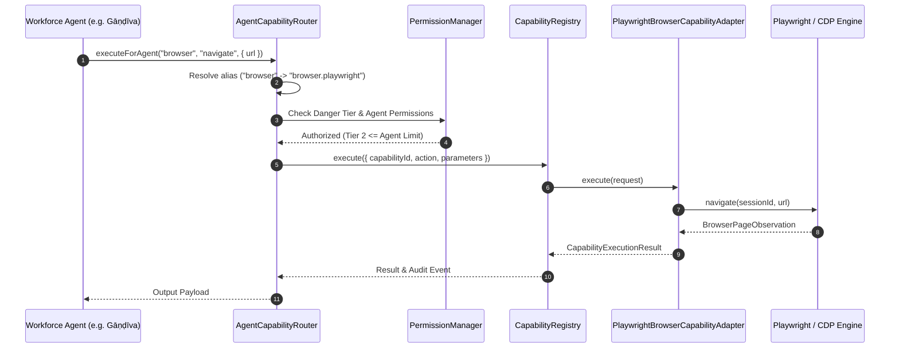

# HṚṢĪKEŚA — Open-Source Capability System Architecture

## 1. Design Philosophy
HṚṢĪKEŚA decouples orchestration intelligence from capability implementations. Agents never communicate directly with raw external libraries; instead, they declare abstract capability intents (e.g. `"browser"`, `"voice"`, `"memory"`) which are resolved, gated, audited, and executed via the **Capability System**.



---

## 2. Standardized Adapter Interface (`ICapabilityAdapter`)

Every internal and external capability implements `ICapabilityAdapter`:

```typescript
export interface ICapabilityAdapter {
  getMetadata(): CapabilityMetadata;
  checkHealth(): Promise<CapabilityHealthCheckResult>;
  execute(request: CapabilityExecutionRequest): Promise<CapabilityExecutionResult>;
  initialize?(): Promise<void>;
  shutdown?(): Promise<void>;
}
```

---

## 3. Capability Metadata Specification

| Field | Description | Example |
| :--- | :--- | :--- |
| `id` | Unique dot-notated identifier | `browser.playwright` |
| `name` | Human-readable title | `Playwright Browser Engine` |
| `category` | High-level domain | `browser`, `voice`, `memory`, `filesystem`, `terminal` |
| `provider` | Authoritative upstream entity | `Microsoft Playwright` |
| `source` | Origin categorization | `open_source`, `native`, `mcp`, `cloud` |
| `license` | SPDX license identifier | `Apache-2.0`, `MIT` |
| `runtimeType` | Execution model | `native`, `subprocess`, `mcp`, `api` |
| `riskLevel` | Danger categorization | `LOW`, `MEDIUM`, `HIGH`, `CRITICAL` |
| `securityStatus`| Verification tier | `VERIFIED`, `COMMUNITY_AUDITED` |

---

## 4. Evaluation Criteria for New Open-Source Additions

Before incorporating any new library into the Capability System, it must pass the 16-point evaluation workflow:
1. Approved permissive license (MIT, Apache-2.0, BSD-3-Clause, ISC).
2. Active maintenance and security issue tracking.
3. Windows 11 Node.js / Python compatibility.
4. Minimal background memory footprint (< 100MB idle).
5. 100% offline local operability without external data exfiltration.
6. Clean isolation via adapter without polluting the kernel control plane.
