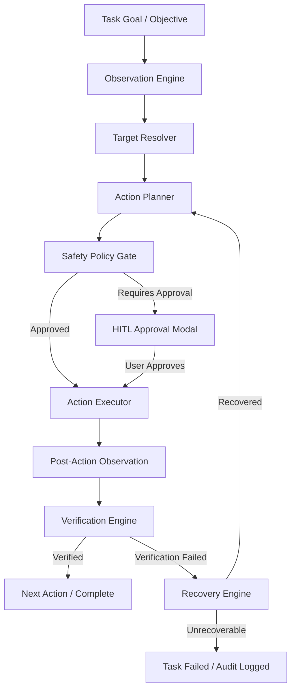

# HṚṢĪKEŚA — Computer Operator Architecture

## Overview
The **Computer Operator** is HṚṢĪKEŚA's autonomous GUI workflow executor. Rather than treating computer operations as isolated mouse and keyboard pulses, the Operator functions as a holistic, perception-driven agent that interacts with desktop windows, controls, menus, inputs, and dialogues with structured planning and verification.

## Core Components

| Component | Responsibility | File Path |
|---|---|---|
| **`ComputerOperator`** | Master workflow coordinator | [`src/computer/operator/services/computer.operator.ts`](file:///c:/Users/Rushi/Desktop/HṚṢĪKEŚA/src/computer/operator/services/computer.operator.ts) |
| **`ComputerObservationEngine`** | Multi-window & UIA tree perception | [`src/computer/operator/services/observation.engine.ts`](file:///c:/Users/Rushi/Desktop/HṚṢĪKEŚA/src/computer/operator/services/observation.engine.ts) |
| **`ComputerWindowManager`** | Active window discovery & context isolation | [`src/computer/operator/services/window.manager.ts`](file:///c:/Users/Rushi/Desktop/HṚṢĪKEŚA/src/computer/operator/services/window.manager.ts) |
| **`ComputerTargetResolver`** | Semantic element resolution & pattern caching | [`src/computer/operator/services/target.resolver.ts`](file:///c:/Users/Rushi/Desktop/HṚṢĪKEŚA/src/computer/operator/services/target.resolver.ts) |
| **`ComputerActionPlanner`** | Plan decomposition & loop prevention | [`src/computer/operator/services/action.planner.ts`](file:///c:/Users/Rushi/Desktop/HṚṢĪKEŚA/src/computer/operator/services/action.planner.ts) |
| **`ComputerActionExecutor`** | Precondition checking & input dispatch | [`src/computer/operator/services/action.executor.ts`](file:///c:/Users/Rushi/Desktop/HṚṢĪKEŚA/src/computer/operator/services/action.executor.ts) |
| **`ComputerVerificationEngine`**| 13 deterministic verification strategies | [`src/computer/operator/services/verification.engine.ts`](file:///c:/Users/Rushi/Desktop/HṚṢĪKEŚA/src/computer/operator/services/verification.engine.ts) |
| **`ComputerRecoveryEngine`** | Failure classification & self-healing | [`src/computer/operator/services/recovery.engine.ts`](file:///c:/Users/Rushi/Desktop/HṚṢĪKEŚA/src/computer/operator/services/recovery.engine.ts) |
| **`ComputerSafetyPolicy`** | Danger tier evaluation & secret redaction | [`src/computer/operator/services/safety.policy.ts`](file:///c:/Users/Rushi/Desktop/HṚṢĪKEŚA/src/computer/operator/services/safety.policy.ts) |
| **`ComputerOperatorRepository`**| SQLite persistence for tasks & actions | [`src/computer/operator/repositories/computer-operator.repository.ts`](file:///c:/Users/Rushi/Desktop/HṚṢĪKEŚA/src/computer/operator/repositories/computer-operator.repository.ts) |

## Context Adapters
- **`NotepadAdapter`**: Specializes standard text document authoring and persistence.
- **`FileDialogAdapter`**: Handles Windows Common File Dialogs (`Save As`, `Open`, `Select Folder`) via atomic sequence generation.
- **`BrowserBridgeAdapter`**: Intelligently routes browser processes to Playwright DOM selectors rather than brittle OCR coordinates.

## Registered Tools
1. **`computer.observe_desktop`** (`TIER_0`): Returns active window title, visible windows, control subtree, and screen bounds.
2. **`computer.execute_task`** (`TIER_2`): Decomposes and executes a structured desktop task with full closed-loop verification.
