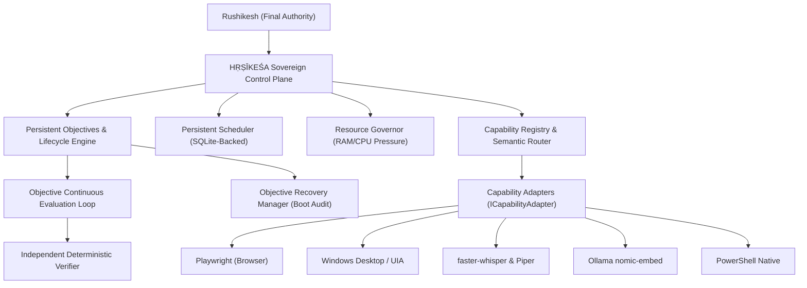

# HṚṢĪKEŚA — Phase 16: Persistent Autonomous Operations & Capability Foundation

## 1. Overview
Phase 16 elevates HṚṢĪKEŚA from a task execution engine to a **persistent autonomous operating system** capable of managing long-running multi-day objectives to completion while safely incorporating vetted open-source capabilities.



---

## 2. Key Architecture Subsystems

### Phase 16A & 16B: Persistent Objective Lifecycle & Health
- **Objective Health States:** `HEALTHY`, `WAITING`, `BLOCKED`, `NEEDS_USER`, `DEGRADED`, `FAILED`, `COMPLETED`.
- **Deterministic Derivation:** Health is derived from runtime evidence (completed milestone counts, pending approvals, task failures, host resource state) rather than model declarations.

### Phase 16C: Continuous Evaluation Loop
- **Bounded Execution:** Every evaluation cycle operates under a strict budget (model calls, task timeouts, replan budgets).
- **Audit Trail:** Every evaluation cycle creates an immutable record in `objective_evaluations` table.

### Phase 16D: Persistent Scheduling Engine
- Supports `ONE_TIME`, `RECURRING` (Cron), `INTERVAL`, `EVENT_DRIVEN`, and `MANUAL` schedule types.
- Persisted in SQLite `schedules` table with full restart resilience.
- Handlers dispatched to goal evaluation, mission generation, or custom callbacks.

### Phase 16F & 16G: Restart & Crash Recovery
- Automatically executed on kernel boot by `ObjectiveRecoveryManager`.
- Hung tasks in `running` state are safely reset to `ready`.
- Active missions and executing goals are recovered without duplicate execution of already completed milestones.

### Phase 16H: Resource Governance
- `ResourceGovernor` continuously monitors memory (`os.freemem()`) and host CPU load.
- Automatically transitions pressure levels (`NORMAL`, `LOW_MEMORY`, `CRITICAL_MEMORY`) and throttles concurrency under memory pressure (< 1.5 GB free RAM).

### Phase 16I, 16J & 16M: Capability Registry & Agent Routing
- Centralized `CapabilityRegistry` indexes metadata, license, security status, and danger tiers.
- Standardized `ICapabilityAdapter` interface wraps Playwright, Windows UIA, Whisper, Piper, and Native FS.
- `AgentCapabilityRouter` translates high-level workforce requests (`"browser"`, `"voice"`, `"memory"`) into authorized adapters with danger tier gating.

---

## 3. Database Schema (Migration 007)

```sql
-- Persistent Schedules
CREATE TABLE IF NOT EXISTS schedules (
  id TEXT PRIMARY KEY,
  name TEXT NOT NULL,
  description TEXT,
  target_type TEXT NOT NULL,
  target_id TEXT NOT NULL,
  schedule_type TEXT NOT NULL,
  cron_expression TEXT,
  interval_ms INTEGER,
  event_pattern TEXT,
  next_run_at TEXT,
  last_run_at TEXT,
  run_count INTEGER NOT NULL DEFAULT 0,
  max_runs INTEGER,
  status TEXT NOT NULL DEFAULT 'ACTIVE',
  payload TEXT,
  created_by TEXT NOT NULL DEFAULT 'rushikesh',
  metadata TEXT,
  created_at TEXT NOT NULL,
  updated_at TEXT NOT NULL
);

-- Objective Evaluation Records
CREATE TABLE IF NOT EXISTS objective_evaluations (
  id TEXT PRIMARY KEY,
  goal_id TEXT NOT NULL,
  cycle_number INTEGER NOT NULL,
  evaluated_at TEXT NOT NULL,
  previous_status TEXT NOT NULL,
  new_status TEXT NOT NULL,
  health_state TEXT NOT NULL,
  health_reason TEXT,
  is_complete INTEGER NOT NULL DEFAULT 0,
  is_blocked INTEGER NOT NULL DEFAULT 0,
  decision TEXT NOT NULL,
  next_action TEXT,
  child_mission_id TEXT,
  model_calls_used INTEGER NOT NULL DEFAULT 0,
  tasks_evaluated INTEGER NOT NULL DEFAULT 0,
  budget_remaining TEXT,
  evidence TEXT,
  created_at TEXT NOT NULL
);
```

---

## 4. Phase 16 REST APIs

| Endpoint | Method | Purpose |
| :--- | :--- | :--- |
| `POST /objectives/:id/evaluate` | POST | Trigger bounded continuous evaluation cycle |
| `GET /objectives/:id/health` | GET | Retrieve deterministic health snapshot |
| `GET /objectives/:id/evaluations` | GET | Retrieve audit trail of evaluation cycles |
| `GET /schedules` | GET | List all persistent schedules |
| `POST /schedules` | POST | Register new persistent schedule |
| `GET /schedules/:id` | GET | Inspect single schedule |
| `POST /schedules/:id/pause` | POST | Pause schedule |
| `POST /schedules/:id/resume` | POST | Resume schedule |
| `DELETE /schedules/:id` | DELETE | Cancel schedule |
| `GET /capabilities` | GET | List all registered capabilities and metadata |
| `GET /capabilities/:id` | GET | Inspect specific capability |
| `GET /capabilities/:id/health` | GET | Check health of single capability adapter |
| `GET /capabilities/health/all` | GET | Batch health check across all adapters |
| `POST /capabilities/execute` | POST | Execute authorized capability action |
| `POST /capabilities/route` | POST | Resolve generic agent request to concrete capability |
| `GET /governance/resources` | GET | Inspect real-time host RAM/CPU governance metrics |
