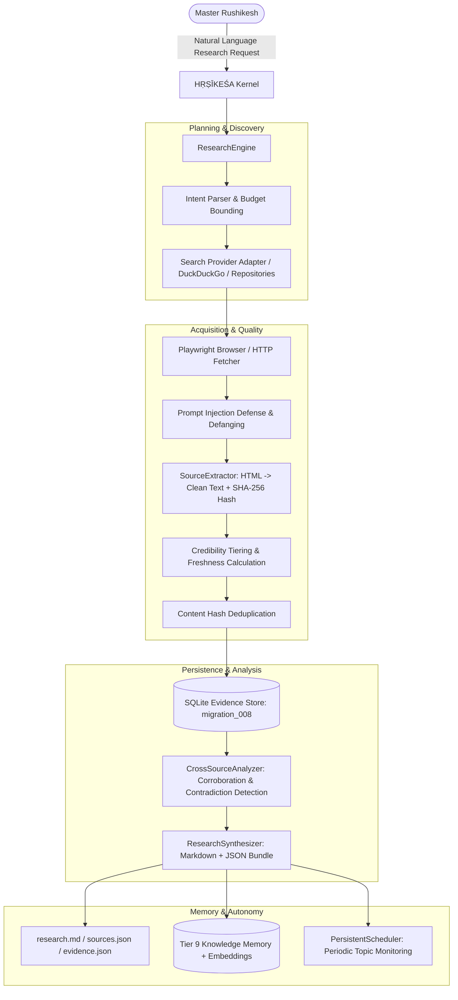

# HṚṢĪKEŚA (हृषीकेश) — Phase 17 Architecture Specification
## Advanced Research & Web Intelligence Subsystem

---

### Executive Summary

Phase 17 introduces **Research Intelligence** into HṚṢĪKEŚA: an evidence-grounded, multi-source discovery, extraction, verification, contradiction detection, and citation synthesis capability.

Unlike simple search wrappers that pass raw search engine snippets directly to a chat model, HṚṢĪKEŚA's Research Intelligence operates as a full-fledged scientific inquiry pipeline:
1. **Intent Formulation:** Natural language research requests are parsed into structured research objectives with depth classifications (`QUICK`, `STANDARD`, `DEEP`) and strict resource budgets (`maxSources`, `maxPages`, `maxBrowserActions`, `maxDurationMs`).
2. **Multi-Source Discovery:** Discovers candidate web sources and open-source repositories via pluggable provider adapters (DuckDuckGo, official API adapters, user-provided URLs).
3. **Acquisition & Sanitization:** Fetches web pages via headless Playwright browser or resilient HTTP streams, defangs script tags, and encapsulates untrusted web text inside `<untrusted_web_content>` security envelopes.
4. **Structured Extraction & Quality Tiering:** Normalizes headings, paragraphs, and metadata, computes deterministic SHA-256 content hashes, evaluates source freshness (`CURRENT`, `RECENT`, `DATED`, `HISTORICAL`, `UNKNOWN`), and classifies credibility tiers (`AUTHORITATIVE`, `PRIMARY`, `SECONDARY`, `COMMUNITY`, `UNVERIFIED`).
5. **Deduplication:** Prevents syndication bias and circular citation by hashing normalized content and flagging duplicate pages across distinct URLs.
6. **Evidence Store & Claim Typology:** Extracts atomic claims and classifies them strictly as `FACT`, `CLAIM`, `INFERENCE`, `OPINION`, or `UNKNOWN`.
7. **Cross-Source Corroboration & Discrepancy Detection:** Analyzes claims across independent domains, computes consensus confidence, flags factual or version contradictions, and assigns verification statuses (`CONFIRMED`, `CORROBORATED`, `CONFLICTING`, `UNVERIFIED`, `INSUFFICIENT_EVIDENCE`).
8. **Traceable Citations & Artifacts:** Synthesizes structured markdown research reports (`research.md`), structured source manifests (`sources.json`), and evidence graph bundles (`evidence.json`) with numbered citations (`[1]`, `[2]`).
9. **Durable Knowledge Memory:** Stores confirmed durable facts into Long-Term Semantic Memory (Tier 9: `knowledge`, `provenance: learned`) with vector indexing for future mission recall.
10. **Persistent Monitoring:** Connects to the Phase 16 `PersistentScheduler` to perform recurring topic tracking and change detection on specified intervals.

---

### Architecture & Data Flow

---

### Database Schema (Migration 008)

Migration `008_research_intelligence_schema.ts` establishes 4 core tables:
1. `research_studies`: Stores research objectives, scope, depth, budget limits, status, completion stats, and artifact paths.
2. `research_sources`: Stores acquired URLs, canonical URLs, titles, publishers, domains, credibility tiers, freshness status, content hashes, and deduplication relationships.
3. `research_evidence`: Stores atomic claims, direct supporting text, claim types (`FACT`, `CLAIM`, `INFERENCE`, `OPINION`), confidence ratings, and locations.
4. `research_findings`: Stores synthesized findings, verification status (`CONFIRMED`, `CORROBORATED`, `CONFLICTING`), corroborating source IDs, conflicting source IDs, and citation mappings.

---

### Security Boundaries & Invariants

1. **Web Content is Untrusted Data:** Web content is never executed as system instructions or allowed to control model tool invocation.
2. **Defanging Indirect Injections:** Any text containing commands (e.g. `powershell.exe`, `process.env`, `ignore previous instructions`) is stripped of executable syntax and strictly isolated inside `<untrusted_web_content>` tags.
3. **Credential Shielding:** API keys, passwords, private configuration, and system prompts are never exposed to external web queries or websites.
4. **Read-Only Safety:** Web research is passive and non-destructive. It never submits forms, creates accounts, bypasses CAPTCHAs/MFAs, or executes downloaded binaries without sovereign human approval.

---

### Verification & Test Coverage

- **Deterministic Unit & Integration Tests:** `tests/phase17-research-intelligence.test.ts` covers 17 comprehensive test suites with zero failures.
- **Isolated Live Verifier:** `scripts/live-phase17-verifier.ts` validates 20 real end-to-end integration scenarios on an isolated database and port 7200.
- **Backward Compatibility:** All 339 tests from Phases 0–16 pass cleanly.
