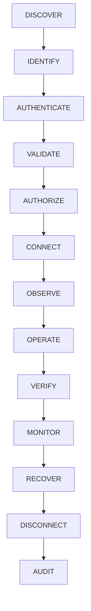

# HṚṢĪKEŚA — PHASE 23: EXTERNAL / ENTERPRISE ENVIRONMENTS

## Executive Summary
Phase 23 introduces an enterprise-grade, environment-aware execution fabric allowing HṚṢĪKEŚA to operate across authorized external targets beyond the local Windows desktop. It establishes a multi-target abstraction layer with zero credential harvesting, danger-tier gating, comprehensive lifecycle control, and real-time observation.

---

## Target Environments
| Environment Type | Adapter | Security & Verification Boundary |
|---|---|---|
| **LOCAL_HOST** | Native System | Baseline local Windows environment |
| **SSH** | `SshEnvironmentAdapter` | Host-key validation, bounded file transfer, credential pointer |
| **WINDOWS_REMOTE** | `WindowsRemoteAdapter` | WinRM / PS remoting, strict command sandboxing |
| **LINUX** | `LinuxEnvironmentAdapter` | Linux privilege tier awareness (`USER`, `SUDO_AVAILABLE`, `ROOT`) |
| **RDP_VDI** | `RdpVdiEnvironmentAdapter` | Desktop session management, UI automation bridge |
| **CLOUD** | `CloudEnvironmentAdapter` | Multi-cloud (AWS, GCP, Azure, OCI) read-only discovery, HITL on mutation |
| **CONTAINER** | `ContainerEnvironmentAdapter` | Docker/Podman container inspection, non-privileged isolation |
| **CI_CD** | `CiEnvironmentAdapter` | GitHub Actions / GitLab CI / Jenkins build inspection |
| **REMOTE_BROWSER** | `RemoteBrowserEnvironmentAdapter`| CDP endpoint connection, headless browser evaluation |

---

## 13-Stage Lifecycle

1. **DISCOVER**: Auto-discovery and registration of targets with initial `DISCOVERED` status.
2. **IDENTIFY**: Safe non-sensitive system fingerprinting (OS, arch, shells, platform).
3. **AUTHENTICATE**: Credential resolution via OS Credential Manager or pause with `NEEDS_USER` for MFA.
4. **VALIDATE**: Host-key validation, reachability check, TLS certificate verification.
5. **AUTHORIZE**: Explicit sovereign approval with trust level (`USER_APPROVED`, `TRUSTED`).
6. **CONNECT**: Session establishment into connection pool.
7. **OBSERVE**: Live health check, telemetry, running process inspection.
8. **OPERATE**: Danger-tiered remote command execution.
9. **VERIFY**: Deterministic proof of execution (exit code, output summary, evidence).
10. **MONITOR**: Lightweight periodic health check and resource utilization.
11. **RECOVER**: Bounded exponential backoff and idempotency-aware retry.
12. **DISCONNECT**: Graceful session termination and connection pool cleanup.
13. **AUDIT**: Immutable SQLite operations ledger recording all operations.

---

## Security Invariants
- **Zero Plaintext Credentials**: No passwords, private keys, or tokens stored in SQLite or logs. Only metadata pointers (`KEYRING_ID`, `ENV_VAR_NAME`).
- **Command Injection Defense**: Interception of shell chaining (`&&`, `||`, `;`, `|`, `` ` ``).
- **Directory Traversal Protection**: Rejection of path escapes (`..`, `\0`, relative paths).
- **Protected Process Shielding**: Protection for critical OS daemons (`systemd`, `winlogon`, `lsass`, `csrss`).
- **Human-in-the-Loop Gating**: Mandates explicit sovereign confirmation for destructive actions (`rm -rf`, `format`, `drop table`, `terminate instance`).
- **Honest Status Reporting**: Reports `NOT_AVAILABLE` for unconfigured cloud/VDI infrastructure without fabricating data.
