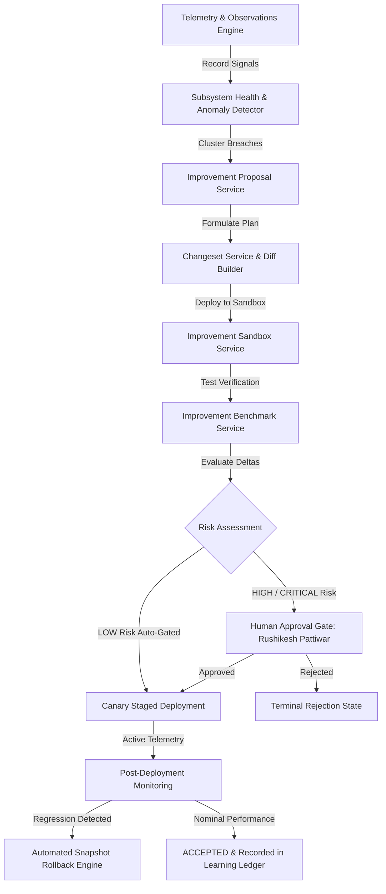

# HṚṢĪKEŚA (हृषीकेश) — PHASE 26: SAFE SELF-IMPROVEMENT & SELF-MAINTENANCE

## 1. Executive Overview

Phase 26 establishes the **Safe Self-Improvement & Self-Maintenance Engine** of HṚṢĪKEŚA. It introduces a closed-loop, deterministic self-evolution architecture allowing HṚṢĪKEŚA to continuously:
$$\text{OBSERVE} \to \text{DIAGNOSE} \to \text{IDENTIFY OPPORTUNITY} \to \text{PROPOSE} \to \text{PLAN} \to \text{ISOLATED CHANGESET} \to \text{TEST} \to \text{BENCHMARK} \to \text{VERIFY} \to \text{REQUEST APPROVAL} \to \text{APPLY} \to \text{VERIFY} \to \text{RECORD} \to \text{LEARN}$$

This engine guarantees absolute safety by enforcing **non-negotiable safety invariants**:
- **Rushikesh Pattiwar** as the final and sovereign human authority.
- **HṚṢĪKEŚA** as the sovereign orchestrator.
- The **17-Agent Workforce** roster is strictly immutable.
- High-risk operations (security, permissions, credentials, payments, core authority) strictly require **Human-in-the-Loop (`HITL`) explicit approval** (`PENDING_APPROVAL \neq APPROVED`).
- Model-generated decisions are **never** treated as human approvals.
- Isolated changesets and sandboxed test execution prevent unverified production mutation.

---

## 2. Core Architecture

---

## 3. Implemented Components

| Subsystem | File Location | Responsibility |
| :--- | :--- | :--- |
| **Domain Types** | `src/self-improvement/interfaces/self-improvement.types.ts` | 20 lifecycle states, 20 categories, 4 risk tiers, telemetry & benchmark interfaces. |
| **Database Migration** | `src/persistence/migrations/017_safe_self_improvement_schema.ts` | 12 relational SQLite tables with indexes for multi-tenant self-evolution. |
| **Repository** | `src/self-improvement/repositories/self-improvement.repository.ts` | SQLite persistence for observations, anomalies, proposals, changesets, benchmarks, rollbacks. |
| **Observation Engine** | `src/self-improvement/services/self-observation.engine.ts` | Telemetry collection, EventBus event listeners, and automated secret redaction. |
| **Health Service** | `src/self-improvement/services/self-health.service.ts` | Real-time health scoring (0–100) across 8 subsystems. |
| **Anomaly Detector** | `src/self-improvement/services/anomaly-detector.service.ts` | Threshold breach detection, error cluster grouping, and severity classification. |
| **Proposal Service** | `src/self-improvement/services/improvement-proposal.service.ts` | Proposal lifecycle manager, risk tier classifier, and HITL gatekeeper. |
| **Changeset Service** | `src/self-improvement/services/changeset.service.ts` | Multi-file unified diff generator and changeset integrity manager. |
| **Sandbox Service** | `src/self-improvement/services/improvement-sandbox.service.ts` | Isolated workspace test execution and deterministic test gating. |
| **Benchmark Service** | `src/self-improvement/services/improvement-benchmark.service.ts` | Multi-metric before/after delta evaluation (`IMPROVED`, `REGRESSED`, `UNCHANGED`). |
| **Rollback Service** | `src/self-improvement/services/improvement-rollback.service.ts` | Staged canary rollout and pre-change snapshot reversion engine. |
| **Maintenance Service** | `src/self-improvement/services/self-maintenance.service.ts` | Temp cleanup, stale session pruning, MCP reconnection, cache rebuild, DB check. |
| **Dependency Intelligence** | `src/self-improvement/services/dependency-intelligence.service.ts` | Package version drift analysis and safe patch recommendations. |
| **Self-Repair Service** | `src/self-improvement/services/self-repair.service.ts` | Bounded self-repair with strict max 3 retry limit. |
| **Coordinator Loop** | `src/self-improvement/services/self-improvement-coordinator.ts` | Sovereign orchestrator coordinating the entire self-evolution lifecycle. |
| **ToolBus Tools** | `src/self-improvement/tools/self-improvement.tools.ts` | 6 typed tools registered with ToolBus (`self.health.inspect`, `self.anomalies.list`, etc.). |
| **REST API** | `src/api/http.server.ts` | 18+ `/self/*` REST API endpoints with full CORS & SPA routing. |
| **Control Center View** | `ui/src/views/SelfImprovementView.tsx` | Full React UI dashboard with health scorecards, proposal board, changesets, maintenance trigger. |

---

## 4. Verification & Metrics

- **Dedicated Phase 26 Tests:** `80 / 80 PASS` (`tests/phase26-self-improvement.test.ts`)
- **Live Operational Verifier:** `42 / 42 PASS` (`scripts/live-phase26-verifier.ts`)
- **Backend TypeScript:** `0 ERRORS` (`npx tsc --noEmit`)
- **UI Production Build:** `PASS` (`npm --prefix ui run build`)
- **Workforce Preservation:** All 17 Agents Verified
- **Authority Hierarchy:** Rushikesh Pattiwar (Final Human Authority) Verified
