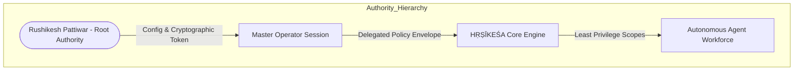

# HṚṢĪKEŚA (हृषीकेश) — Security, Governance & Compliance Architecture

> **Document Status:** Active Standard — Phase 1  
> **Sovereign Root:** Rushikesh Pattiwar  
> **Classification:** Strict Internal Governance  

---

## 1. Foundational Security Principles

Security in HṚṢĪKEŚA is not a secondary add-on; it is an intrinsic boundary condition of the control plane.

1. **Sovereignty of Rushikesh Pattiwar:** The system has exactly one legitimate master and root authority. All autonomous activities derive their mandate from Rushikesh's explicit or delegated intent.
2. **Zero Trust & Least Privilege:** No agent, model, tool, or external script is implicitly trusted. Every capability is granted with the narrowest scope necessary for the immediate task.
3. **Defense in Depth:** Security is enforced across multiple independent barriers: identity verification, danger-tier gating, sandboxed execution, and append-only auditing.
4. **Observable Autonomy:** Every action taken by an agent must be auditable, deterministic, verifiable, and revocable.
5. **No Security Evasion:** HṚṢĪKEŚA is an authorized productivity platform. It strictly forbids features designed to bypass enterprise security, DLP, endpoint monitoring, MFA, or CAPTCHA.

---

## 2. Identity & Authority Model

### Identity Specification
- **Root Subject:** `ROOT_RUSHIKESH`
- **Authentication:** Local session pairing, optional hardware security key / passphrase for high-tier actions.
- **Delegation Scope:** Sub-agents only inherit explicitly whitelisted sub-permissions. An agent assigned to documentation cannot trigger shell execution or network requests.

---

## 3. Action Danger Tiers & Approval Gates

All system actions are statically categorized into five danger tiers:

| Tier | Classification | Definition & Examples | Authorization Requirement |
| :---: | :--- | :--- | :--- |
| **0** | **Pure Read-Only** | Reading source code, reading memory, querying local vector DB, inspecting system specs | Autonomous execution; logged in session history |
| **1** | **Low-Impact Reversible** | Writing to temporary scratchpad, formatting test code, running local unit tests | Autonomous execution; logged in audit ledger |
| **2** | **Project State Modification** | Creating files in project directory, git commit, installing npm/pip dependencies inside venv | Autonomous if within active project scope; requires prompt if outside scope |
| **3** | **System Level Changes** | Installing desktop applications, modifying Windows Registry, executing elevated commands | **Mandatory Interactive Human Approval Gate** |
| **4** | **Critical & Irreversible** | Pushing to remote repositories, deleting directories, exposing network ports, modifying credentials | **Explicit Interactive Confirmation with Visual Diff / Summary** |

---

## 4. Secrets Management & Credential Isolation

- **Zero Secrets in Code:** Passwords, API tokens, private keys, and session cookies must never appear in source code, configuration files committed to Git, or prompt logs.
- **Storage Standards:**
  - System and provider API keys are stored in the OS-native **Windows Credential Manager** or an encrypted `.env.local` file explicitly excluded by `.gitignore`.
  - In-memory keys are wiped upon process termination and never written to persistent SQLite memory or vector indexes.
- **Provider API Keys:** Managed through authorized environment variables (`ANTHROPIC_API_KEY`, `OPENAI_API_KEY`, `GEMINI_API_KEY`).
- **Secret Redaction:** The logging and memory bus actively intercepts and masks patterns matching API keys, tokens, and authorization headers before logging.

---

## 5. Enterprise & VDI Compliance Guidelines

A core capability of HṚṢĪKEŚA is assisting Rushikesh in authorized remote desktop and VDI sessions (e.g., corporate or client development environments).

### Compliance Boundaries:
1. **External Operation Only:** HṚṢĪKEŚA runs on the local personal machine and interacts with the VDI window using standard visual inspection and input simulation.
2. **Zero Footprint in VDI:** No HṚṢĪKEŚA runtime code, server, or binary is installed into the remote VDI session.
3. **No Credential Harvesting:** HṚṢĪKEŚA does not harvest, store, or intercept enterprise VDI passwords, MFA tokens, or smart-card credentials.
4. **No Monitoring Evasion:** The system will never attempt to evade endpoint detection and response (EDR), disable security agents, defeat DLP monitors, or circumvent enterprise proxies.
5. **No CAPTCHA Bypass:** The system will never include automated CAPTCHA-cracking routines intended to bypass bot protections.

---

## 6. Sandboxing & Tool Execution Safety (Phase 4 Specification)

- **Vendor-Neutral Tool Execution Bus:** All tool calls execute exclusively through `ToolExecutionBus` with an immutable 7-stage pipeline:
  `Validate Tool` → `Validate Schema` → `Permission Check` → `Approval Gate` → `Execute` → `Validate Result` → `Audit` → `Return`.
  Tools are never invoked directly by language models or arbitrary callers.
- **Strict Workspace Containment:** Filesystem tools (`filesystem.list`, `filesystem.read`, `filesystem.write`) strictly validate normalized paths against the active `workspaceRoot`. Relative paths utilizing `..` or absolute paths outside the designated workspace root trigger an immediate hard security rejection.
- **Command Whitelisting (Phase 4):** `terminal.execute` strictly restricts commands in Phase 4 to read-only diagnostics (`dir`, `ls`, `echo`, `node -v`, `git status`, `hostname`). Arbitrary command execution, PowerShell scripts, and elevated utilities are blocked.
- **Model Context Protocol (MCP) Containment:** External MCP servers connect via `McpClientAdapter`. All tools imported via MCP are normalized into standard `ITool` definitions and mapped to appropriate `DangerTier`s. MCP tools are strictly prohibited from bypassing HṚṢĪKEŚA's permission or approval gates.
- **Bounded Conversational Loops:** Automated model tool invocation is capped at a maximum of 2 iterations (`maxToolIterations = 2`) to prevent recursive execution loops or hallucinated tool storms.

---

## 7. Audit Logging & Verification

- **Append-Only Tool Audit Ledger:** Every execution attempt (allowed, denied, failed, or successful) is logged with `requestId`, `sessionId`, `toolId`, `riskLevel`, `decision`, `durationMs`, and `status`.
- **Secret Redaction:** The audit logger intercepts arguments and redacts sensitive credentials (API keys, authorization tokens, passwords, private keys) before storing records into the SQLite `memory_items` table under tier `system_audit` with provenance `system`.
- **Verification Requirement:** No tool execution or task completion is marked successful based on the model's self-assessment. Verification must be confirmed by programmatic exit codes, file existence checks, or compiler pass results.

---

## 8. Multi-Agent Workforce & Delegation Security Boundaries (Phase 5)

Phase 5 enforces strict containment on agent autonomy:

1. **Subordinate Permission Enforcement:**
   - Agent definitions define allowed tools and maximum danger tiers (e.g. `TIER_1`).
   - Agent permissions are strictly subordinate to the global `PermissionManager`. An agent cannot elevate its own permissions or grant permissions to other agents.
   - Any tool call outside an agent's whitelist or exceeding its danger tier limit is rejected before reaching the `ToolExecutionBus`.
2. **Constrained Delegation Limits:**
   - Maximum delegation depth: **2** (Root task → Child task → Sub-child task).
   - Maximum child tasks per parent: **5**.
   - Maximum active concurrent tasks per agent: **3**.
   - Recursive spawning attempts exceeding these limits throw security rejections.
3. **Model Resource & Inference Locks:**
   - Single-inference lock ensures that multiple agents cannot trigger concurrent local LLM processes, preventing memory exhaustion on the host (15.7 GB RAM limit).
4. **Shared Blackboard Auditing:**
   - All findings published to the blackboard are attributed to a verified `agentId`, `missionId`, and `taskId`. Findings cannot alter agent policies or core system configurations.

---

## 9. Browser Security & Sandbox Boundaries (Phase 6)

Phase 6 implements strict browser containment rules:

1. **URL Protocol Whitelist:**
   - Permitted navigation protocols: `http:`, `https:`.
   - Prohibited protocols (trigger hard security violations): `file://`, `javascript:`, `data:`, `vbscript:`, `blob:`, `about:`, `chrome:`, `edge:`, `ws:`, `wss:`.
   - The browser cannot be coerced into reading arbitrary local files or executing inline scripts via URI schemes.
2. **Context Isolation & Anti-Exfiltration:**
   - Every browser session runs in an ephemeral, incognito `BrowserContext`.
   - Cookies, local storage, and history are discarded upon session close.
   - The browser engine does not access the user's host Chrome/Edge personal profile or saved browser passwords.
3. **Strict Compliance & Anti-Evasion Invariants:**
   - The system strictly forbids CAPTCHA bypass, MFA cracking, proxy manipulation, or rate-limit evasion.
   - If a website presents a CAPTCHA or verification challenge, the browser adapter detects the marker, halts autonomous execution, and flags `humanInterventionRequired: true`.
4. **Credential Redaction in Form Inputs:**
   - Arguments passed to `browser.type` (passwords, tokens, keys) are intercepted and redacted by `ToolAuditManager` before writing to the SQLite audit database.

---

## 10. Desktop Input & Application Launch Governance (Phase 7)

Phase 7 establishes strict safety boundaries for Windows desktop automation:

1. **Constrained Application Allowlist:**
   - The launcher strictly permits explicitly registered application identifiers: `notepad`, `calculator`/`calc`, `paint`, `browser`, `android-studio`, `blender`.
   - Execution of arbitrary executable paths, command shells (`cmd.exe`, `powershell.exe`), batch files, or unlisted binaries is strictly blocked.
2. **Display Coordinate Boundaries:**
   - Mouse coordinates (x, y) are strictly checked against physical display boundaries.
   - Negative coordinates, non-finite values, and coordinates exceeding screen resolution throw immediate validation exceptions.
3. **Typing Payload Rate Limiting & Caps:**
   - Text typed via `computer.keyboard.type` is capped at a maximum of 500 characters per invocation.
   - Payloads containing credentials, API keys, or authorization tokens are automatically sanitized in the audit ledger.
4. **No Security Evasion or Hidden Desktop Access:**
   - Automation operates through standard foreground OS input simulation.
   - Never bypasses Windows UAC prompts, authentication, endpoint security controls, or Windows Defender.
   - If an application demands administrative elevation or biometric/MFA authentication, execution pauses for human intervention.
5. **Session Process Cleanup & Lifecycle Protection:**
   - All processes spawned by HṚṢĪKEŚA are tracked by PID and cleanly terminated upon kernel shutdown.

---

## 11. Voice Input Governance & Audio Sandboxing (Phase 8)

Phase 8 implements strict privacy and security controls for audio recording, speech recognition, and speech synthesis:

1. **Uniform Permission Enforcement:**
   - Spoken voice input is treated with the exact same security policies as typed input.
   - Proposing dangerous tools via voice (e.g. destructive file writes or terminal commands) is strictly gated by the `PermissionManager` (Tiers 0–4) and requires human authorization.
2. **Local-First Audio Processing:**
   - Audio transcription (STT) and voice synthesis (TTS) operate 100% locally and offline.
   - Microphone data is never transmitted to cloud endpoints without explicit authorization.
3. **Ephemeral Audio Storage & Privacy:**
   - Raw microphone audio is captured exclusively on explicit push-to-talk triggers.
   - Audio files are stored under gitignored artifact paths (`data/audio/`) and are never injected as raw binaries into the LLM context.
4. **Secret Redaction in Voice Transcripts:**
   - Any sensitive tokens, passwords, or credentials recognized in speech input are redacted in audit logging.
5. **No Stealth Recording or Always-Listening Surveillance:**
   - Push-to-talk semantics prevent perpetual background microphone snooping.
   - Background audio recorders are automatically stopped and disposed upon kernel shutdown.

---

## 12. Semantic UI Automation Governance & Freshness Validation (Phase 9)

Phase 9 establishes strict guardrails for Windows UI Automation (UIA) tree inspection and semantic element manipulation:

1. **Element Freshness & Stale Reference Invalidation:**
   - Element IDs (`elem_1`, `elem_2`) are transient identifiers tied to a specific window observation snapshot.
   - Before executing an action (`click`, `focus`, `type`, `keypress`), the adapter validates that the element belongs to the currently active window and that its bounding box is non-zero.
   - Stale element references throw explicit errors instructing the agent to refresh via `computer.ui.observe`.
2. **Context Budget Protection & Tree Caps:**
   - Maximum tree traversal depth is capped at 5 levels (default 3).
   - Maximum total elements returned to the model is capped at 150 (default 60).
   - Element text and names are truncated to 500 characters.
   - Prevents overwhelming LLM context windows or causing token exhaustion.
3. **Automatic Password & Credential Masking:**
   - Any UI element whose `name`, `automationId`, or `className` contains `password`, `pin`, `secret`, or `token` has its `value` masked as `[REDACTED]`.
   - Protects against accidental credential harvesting or leaking sensitive authentication secrets into model context or persistent memory.
4. **Selector Injection Defense:**
   - Semantic search criteria inputs are sanitized against command injection characters (`;`, `` ` ``, `$`, `\r`, `\n`, `|`, `&`, `<`, `>`).
   - Unsafe or malformed criteria are rejected before invocation.
5. **No CAPTCHA / MFA / UAC Bypass:**
   - The UIA subsystem does not automate or bypass Windows User Account Control (UAC) elevation dialogs, Windows Security credential prompts, biometric auth, or CAPTCHA challenges.
6. **Graceful Fallback to Coordinate Primitives:**
   - When custom rendered applications (e.g. game engines, remote desktop canvases) do not expose accessibility trees, the system gracefully falls back to coordinate primitives (`computer.mouse.*`, `computer.keyboard.*`, `computer.screenshot`).

---

## 13. Software & Environment Management Governance (Phase 10)

Phase 10 establishes strict safety boundaries for software discovery, process lifecycle management, executable verification, and package management:

1. **Untrusted Path Rejection & Source Validation:**
   - HṚṢĪKEŚA never executes arbitrary executable paths provided by an LLM prompt.
   - Every executable path must be resolved through trusted discovery mechanisms: Known Application Catalog, Windows Start Menu shortcuts (`.lnk` targets), Windows Registry App Paths, or PATH lookup via `where.exe`.
   - Paths pointing to temp directories, network shares, non-existent files, or unverified locations are strictly rejected.
2. **Protected Process Invariant:**
   - HṚṢĪKEŚA strictly forbids terminating system-critical OS processes: PID 0 (`System Idle Process`), PID 4 (`System`), `csrss.exe`, `lsass.exe`, `smss.exe`, `services.exe`, `winlogon.exe`, `explorer.exe`, `svchost.exe`, `dwm.exe`, `spoolsv.exe`, `rundll32.exe`, `antigravity.exe`.
   - Attempting to terminate any protected process immediately triggers a critical security violation.
3. **Process Ownership & Authorized Termination:**
   - HṚṢĪKEŚA maintains an internal registry of processes spawned during the current session (`isHrisekesaSpawned: true`).
   - Termination of an external or untracked process requires Danger Tier 2 authorization and explicit human approval.
4. **Constrained Package Management via winget:**
   - Package manager integration is strictly constrained to typed operations: `package.search`, `package.inspect`, and `package.install`.
   - Arbitrary CLI commands (`winget <anything>`) are prohibited.
   - Package identifiers are strictly validated against `/^[a-zA-Z0-9\-_.]+$/`.
   - Package installations require Danger Tier 2 human approval.
5. **UAC Pause Detection & Zero Privilege Escalation:**
   - HṚṢĪKEŚA never attempts to bypass Windows User Account Control (UAC).
   - If an installation requires administrative elevation, the adapter detects the UAC condition, pauses execution, and flags `humanInterventionRequired: true`.
6. **Immutable Audit & Secret Redaction:**
   - All environment operations (discovery, launch, termination, package search, installation) are recorded in the immutable SQLite audit ledger.
   - Command-line arguments containing passwords, tokens, or API keys are masked with `[REDACTED]`.
