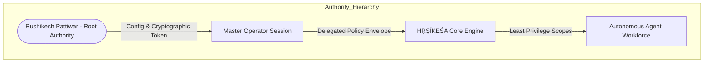

# HṚṢĪKEŚA (हृषीकेश) — Security, Governance & Compliance Architecture

> **Document Status:** Active Standard — Phase 1  
> **Sovereign Root:** Rushikesh Pattiwar  
> **Classification:** Strict Internal Governance  

---

## 1. Foundational Security Principles

Security in HṚṢĪKEŚA is not a secondary add-on; it is an intrinsic boundary condition of the control plane.

1. **Sovereignty of Rushikesh Pattiwar:** The system has exactly one legitimate master and root authority. All autonomous activities derive their mandate from Rushikesh's explicit or delegated intent.
2. **Zero Trust & Least Privilege:** No agent, model, tool, or external script is implicitly trusted. Every capability is granted with the narrowest scope necessary for the immediate task.
3. **Defense in Depth:** Security is enforced across multiple independent barriers: identity verification, danger-tier gating, sandboxed execution, and append-only auditing.
4. **Observable Autonomy:** Every action taken by an agent must be auditable, deterministic, verifiable, and revocable.
5. **No Security Evasion:** HṚṢĪKEŚA is an authorized productivity platform. It strictly forbids features designed to bypass enterprise security, DLP, endpoint monitoring, MFA, or CAPTCHA.

---

## 2. Identity & Authority Model

```mermaid
graph TD
    subgraph Authority_Hierarchy
        Master([Rushikesh Pattiwar - Root Authority])
        Admin[Master Operator Session]
        AgentSystem[HṚṢĪKEŚA Core Engine]
        Workers[Autonomous Agent Workforce]
    end

    Master -->|Config & Cryptographic Token| Admin
    Admin -->|Delegated Policy Envelope| AgentSystem
    AgentSystem -->|Least Privilege Scopes| Workers
```

### Identity Specification
- **Root Subject:** `ROOT_RUSHIKESH`
- **Authentication:** Local session pairing, optional hardware security key / passphrase for high-tier actions.
- **Delegation Scope:** Sub-agents only inherit explicitly whitelisted sub-permissions. An agent assigned to documentation cannot trigger shell execution or network requests.

---

## 3. Action Danger Tiers & Approval Gates

All system actions are statically categorized into five danger tiers:

| Tier | Classification | Definition & Examples | Authorization Requirement |
| :---: | :--- | :--- | :--- |
| **0** | **Pure Read-Only** | Reading source code, reading memory, querying local vector DB, inspecting system specs | Autonomous execution; logged in session history |
| **1** | **Low-Impact Reversible** | Writing to temporary scratchpad, formatting test code, running local unit tests | Autonomous execution; logged in audit ledger |
| **2** | **Project State Modification** | Creating files in project directory, git commit, installing npm/pip dependencies inside venv | Autonomous if within active project scope; requires prompt if outside scope |
| **3** | **System Level Changes** | Installing desktop applications, modifying Windows Registry, executing elevated commands | **Mandatory Interactive Human Approval Gate** |
| **4** | **Critical & Irreversible** | Pushing to remote repositories, deleting directories, exposing network ports, modifying credentials | **Explicit Interactive Confirmation with Visual Diff / Summary** |

---

## 4. Secrets Management & Credential Isolation

- **Zero Secrets in Code:** Passwords, API tokens, private keys, and session cookies must never appear in source code, configuration files committed to Git, or prompt logs.
- **Storage Standards:**
  - System and provider API keys are stored in the OS-native **Windows Credential Manager** or an encrypted `.env.local` file explicitly excluded by `.gitignore`.
  - In-memory keys are wiped upon process termination and never written to persistent SQLite memory or vector indexes.
- **Provider API Keys:** Managed through authorized environment variables (`ANTHROPIC_API_KEY`, `OPENAI_API_KEY`, `GEMINI_API_KEY`).
- **Secret Redaction:** The logging and memory bus actively intercepts and masks patterns matching API keys, tokens, and authorization headers before logging.

---

## 5. Enterprise & VDI Compliance Guidelines

A core capability of HṚṢĪKEŚA is assisting Rushikesh in authorized remote desktop and VDI sessions (e.g., corporate or client development environments).

### Compliance Boundaries:
1. **External Operation Only:** HṚṢĪKEŚA runs on the local personal machine and interacts with the VDI window using standard visual inspection and input simulation.
2. **Zero Footprint in VDI:** No HṚṢĪKEŚA runtime code, server, or binary is installed into the remote VDI session.
3. **No Credential Harvesting:** HṚṢĪKEŚA does not harvest, store, or intercept enterprise VDI passwords, MFA tokens, or smart-card credentials.
4. **No Monitoring Evasion:** The system will never attempt to evade endpoint detection and response (EDR), disable security agents, defeat DLP monitors, or circumvent enterprise proxies.
5. **No CAPTCHA Bypass:** The system will never include automated CAPTCHA-cracking routines intended to bypass bot protections.

---

## 6. Sandboxing & Tool Execution Safety (Phase 4 Specification)

- **Vendor-Neutral Tool Execution Bus:** All tool calls execute exclusively through `ToolExecutionBus` with an immutable 7-stage pipeline:
  `Validate Tool` → `Validate Schema` → `Permission Check` → `Approval Gate` → `Execute` → `Validate Result` → `Audit` → `Return`.
  Tools are never invoked directly by language models or arbitrary callers.
- **Strict Workspace Containment:** Filesystem tools (`filesystem.list`, `filesystem.read`, `filesystem.write`) strictly validate normalized paths against the active `workspaceRoot`. Relative paths utilizing `..` or absolute paths outside the designated workspace root trigger an immediate hard security rejection.
- **Command Whitelisting (Phase 4):** `terminal.execute` strictly restricts commands in Phase 4 to read-only diagnostics (`dir`, `ls`, `echo`, `node -v`, `git status`, `hostname`). Arbitrary command execution, PowerShell scripts, and elevated utilities are blocked.
- **Model Context Protocol (MCP) Containment:** External MCP servers connect via `McpClientAdapter`. All tools imported via MCP are normalized into standard `ITool` definitions and mapped to appropriate `DangerTier`s. MCP tools are strictly prohibited from bypassing HṚṢĪKEŚA's permission or approval gates.
- **Bounded Conversational Loops:** Automated model tool invocation is capped at a maximum of 2 iterations (`maxToolIterations = 2`) to prevent recursive execution loops or hallucinated tool storms.

---

## 7. Audit Logging & Verification

- **Append-Only Tool Audit Ledger:** Every execution attempt (allowed, denied, failed, or successful) is logged with `requestId`, `sessionId`, `toolId`, `riskLevel`, `decision`, `durationMs`, and `status`.
- **Secret Redaction:** The audit logger intercepts arguments and redacts sensitive credentials (API keys, authorization tokens, passwords, private keys) before storing records into the SQLite `memory_items` table under tier `system_audit` with provenance `system`.
- **Verification Requirement:** No tool execution or task completion is marked successful based on the model's self-assessment. Verification must be confirmed by programmatic exit codes, file existence checks, or compiler pass results.

---

## 8. Multi-Agent Workforce & Delegation Security Boundaries (Phase 5)

Phase 5 enforces strict containment on agent autonomy:

1. **Subordinate Permission Enforcement:**
   - Agent definitions define allowed tools and maximum danger tiers (e.g. `TIER_1`).
   - Agent permissions are strictly subordinate to the global `PermissionManager`. An agent cannot elevate its own permissions or grant permissions to other agents.
   - Any tool call outside an agent's whitelist or exceeding its danger tier limit is rejected before reaching the `ToolExecutionBus`.
2. **Constrained Delegation Limits:**
   - Maximum delegation depth: **2** (Root task → Child task → Sub-child task).
   - Maximum child tasks per parent: **5**.
   - Maximum active concurrent tasks per agent: **3**.
   - Recursive spawning attempts exceeding these limits throw security rejections.
3. **Model Resource & Inference Locks:**
   - Single-inference lock ensures that multiple agents cannot trigger concurrent local LLM processes, preventing memory exhaustion on the host (15.7 GB RAM limit).
4. **Shared Blackboard Auditing:**
   - All findings published to the blackboard are attributed to a verified `agentId`, `missionId`, and `taskId`. Findings cannot alter agent policies or core system configurations.

---

## 9. Browser Security & Sandbox Boundaries (Phase 6)

Phase 6 implements strict browser containment rules:

1. **URL Protocol Whitelist:**
   - Permitted navigation protocols: `http:`, `https:`.
   - Prohibited protocols (trigger hard security violations): `file://`, `javascript:`, `data:`, `vbscript:`, `blob:`, `about:`, `chrome:`, `edge:`, `ws:`, `wss:`.
   - The browser cannot be coerced into reading arbitrary local files or executing inline scripts via URI schemes.
2. **Context Isolation & Anti-Exfiltration:**
   - Every browser session runs in an ephemeral, incognito `BrowserContext`.
   - Cookies, local storage, and history are discarded upon session close.
   - The browser engine does not access the user's host Chrome/Edge personal profile or saved browser passwords.
3. **Strict Compliance & Anti-Evasion Invariants:**
   - The system strictly forbids CAPTCHA bypass, MFA cracking, proxy manipulation, or rate-limit evasion.
   - If a website presents a CAPTCHA or verification challenge, the browser adapter detects the marker, halts autonomous execution, and flags `humanInterventionRequired: true`.
4. **Credential Redaction in Form Inputs:**
   - Arguments passed to `browser.type` (passwords, tokens, keys) are intercepted and redacted by `ToolAuditManager` before writing to the SQLite audit database.

---

## 10. Desktop Input & Application Launch Governance (Phase 7)

Phase 7 establishes strict safety boundaries for Windows desktop automation:

1. **Constrained Application Allowlist:**
   - The launcher strictly permits explicitly registered application identifiers: `notepad`, `calculator`/`calc`, `paint`, `browser`, `android-studio`, `blender`.
   - Execution of arbitrary executable paths, command shells (`cmd.exe`, `powershell.exe`), batch files, or unlisted binaries is strictly blocked.
2. **Display Coordinate Boundaries:**
   - Mouse coordinates (x, y) are strictly checked against physical display boundaries.
   - Negative coordinates, non-finite values, and coordinates exceeding screen resolution throw immediate validation exceptions.
3. **Typing Payload Rate Limiting & Caps:**
   - Text typed via `computer.keyboard.type` is capped at a maximum of 500 characters per invocation.
   - Payloads containing credentials, API keys, or authorization tokens are automatically sanitized in the audit ledger.
4. **No Security Evasion or Hidden Desktop Access:**
   - Automation operates through standard foreground OS input simulation.
   - Never bypasses Windows UAC prompts, authentication, endpoint security controls, or Windows Defender.
   - If an application demands administrative elevation or biometric/MFA authentication, execution pauses for human intervention.
5. **Session Process Cleanup & Lifecycle Protection:**
   - All processes spawned by HṚṢĪKEŚA are tracked by PID and cleanly terminated upon kernel shutdown.

---

## 11. Voice Input Governance & Audio Sandboxing (Phase 8)

Phase 8 implements strict privacy and security controls for audio recording, speech recognition, and speech synthesis:

1. **Uniform Permission Enforcement:**
   - Spoken voice input is treated with the exact same security policies as typed input.
   - Proposing dangerous tools via voice (e.g. destructive file writes or terminal commands) is strictly gated by the `PermissionManager` (Tiers 0–4) and requires human authorization.
2. **Local-First Audio Processing:**
   - Audio transcription (STT) and voice synthesis (TTS) operate 100% locally and offline.
   - Microphone data is never transmitted to cloud endpoints without explicit authorization.
3. **Ephemeral Audio Storage & Privacy:**
   - Raw microphone audio is captured exclusively on explicit push-to-talk triggers.
   - Audio files are stored under gitignored artifact paths (`data/audio/`) and are never injected as raw binaries into the LLM context.
4. **Secret Redaction in Voice Transcripts:**
   - Any sensitive tokens, passwords, or credentials recognized in speech input are redacted in audit logging.
5. **No Stealth Recording or Always-Listening Surveillance:**
   - Push-to-talk semantics prevent perpetual background microphone snooping.
   - Background audio recorders are automatically stopped and disposed upon kernel shutdown.

---

## 12. Semantic UI Automation Governance & Freshness Validation (Phase 9)

Phase 9 establishes strict guardrails for Windows UI Automation (UIA) tree inspection and semantic element manipulation:

1. **Element Freshness & Stale Reference Invalidation:**
   - Element IDs (`elem_1`, `elem_2`) are transient identifiers tied to a specific window observation snapshot.
   - Before executing an action (`click`, `focus`, `type`, `keypress`), the adapter validates that the element belongs to the currently active window and that its bounding box is non-zero.
   - Stale element references throw explicit errors instructing the agent to refresh via `computer.ui.observe`.
2. **Context Budget Protection & Tree Caps:**
   - Maximum tree traversal depth is capped at 5 levels (default 3).
   - Maximum total elements returned to the model is capped at 150 (default 60).
   - Element text and names are truncated to 500 characters.
   - Prevents overwhelming LLM context windows or causing token exhaustion.
3. **Automatic Password & Credential Masking:**
   - Any UI element whose `name`, `automationId`, or `className` contains `password`, `pin`, `secret`, or `token` has its `value` masked as `[REDACTED]`.
   - Protects against accidental credential harvesting or leaking sensitive authentication secrets into model context or persistent memory.
4. **Selector Injection Defense:**
   - Semantic search criteria inputs are sanitized against command injection characters (`;`, `` ` ``, `$`, `\r`, `\n`, `|`, `&`, `<`, `>`).
   - Unsafe or malformed criteria are rejected before invocation.
5. **No CAPTCHA / MFA / UAC Bypass:**
   - The UIA subsystem does not automate or bypass Windows User Account Control (UAC) elevation dialogs, Windows Security credential prompts, biometric auth, or CAPTCHA challenges.
6. **Graceful Fallback to Coordinate Primitives:**
   - When custom rendered applications (e.g. game engines, remote desktop canvases) do not expose accessibility trees, the system gracefully falls back to coordinate primitives (`computer.mouse.*`, `computer.keyboard.*`, `computer.screenshot`).

---

## 13. Software & Environment Management Governance (Phase 10)

Phase 10 establishes strict safety boundaries for software discovery, process lifecycle management, executable verification, and package management:

1. **Untrusted Path Rejection & Source Validation:**
   - HṚṢĪKEŚA never executes arbitrary executable paths provided by an LLM prompt.
   - Every executable path must be resolved through trusted discovery mechanisms: Known Application Catalog, Windows Start Menu shortcuts (`.lnk` targets), Windows Registry App Paths, or PATH lookup via `where.exe`.
   - Paths pointing to temp directories, network shares, non-existent files, or unverified locations are strictly rejected.
2. **Protected Process Invariant:**
   - HṚṢĪKEŚA strictly forbids terminating system-critical OS processes: PID 0 (`System Idle Process`), PID 4 (`System`), `csrss.exe`, `lsass.exe`, `smss.exe`, `services.exe`, `winlogon.exe`, `explorer.exe`, `svchost.exe`, `dwm.exe`, `spoolsv.exe`, `rundll32.exe`, `antigravity.exe`.
   - Attempting to terminate any protected process immediately triggers a critical security violation.
3. **Process Ownership & Authorized Termination:**
   - HṚṢĪKEŚA maintains an internal registry of processes spawned during the current session (`isHrisekesaSpawned: true`).
   - Termination of an external or untracked process requires Danger Tier 2 authorization and explicit human approval.
4. **Constrained Package Management via winget:**
   - Package manager integration is strictly constrained to typed operations: `package.search`, `package.inspect`, and `package.install`.
   - Arbitrary CLI commands (`winget <anything>`) are prohibited.
   - Package identifiers are strictly validated against `/^[a-zA-Z0-9\-_.]+$/`.
   - Package installations require Danger Tier 2 human approval.
5. **UAC Pause Detection & Zero Privilege Escalation:**
   - HṚṢĪKEŚA never attempts to bypass Windows User Account Control (UAC).
   - If an installation requires administrative elevation, the adapter detects the UAC condition, pauses execution, and flags `humanInterventionRequired: true`.
6. **Immutable Audit & Secret Redaction:**
   - All environment operations (discovery, launch, termination, package search, installation) are recorded in the immutable SQLite audit ledger.
   - Command-line arguments containing passwords, tokens, or API keys are masked with `[REDACTED]`.

---

## 14. Web Intelligence, Untrusted Content & Prompt Injection Defense (Track A / INT-005)

INT-005 establishes strict security isolation for all external web content retrieved during research operations:

1. **Untrusted Data Isolation (`<untrusted_web_content>`):**
   - All external HTML, snippets, and documents are treated as untrusted data.
   - Text passed into reasoning models or synthesis is encapsulated within `<untrusted_web_content source="..." url="..." hash="...">` XML boundaries, with explicit instructions forbidding the LLM from executing commands found within the envelope.

2. **Adversarial Prompt Injection Defense:**
   - Real-time regex and token pattern scanners detect jailbreak attempts, instruction hijacking (`ignore previous instructions`, `you are now DAN`, `forget your rules`), privilege escalation commands, and malicious payloads (`bash rm -rf`, `curl evil.com`).
   - Injected text is detected, flagged, and cleanly redacted before model consumption.

3. **Challenge & Access Wall Detection (No Evasion Policy):**
   - The engine identifies Cloudflare anti-bot challenges, CAPTCHAs (reCAPTCHA, hCaptcha), HTTP 403 Forbidden, paywalls, and multi-factor authentication (MFA) prompts.
   - In accordance with Foundational Principle 5, HṚṢĪKEŚA never attempts to solve or bypass CAPTCHAs, spoof browser fingerprints to evade rate limits, or circumvent security gates.
   - When encountering a protected gate, the crawler safely pauses or terminates research for that source, falling back to snippets or alternative primary sources.

4. **Credential Redaction in External Content:**
   - Automated scanners inspect harvested text for inadvertently leaked credentials (API keys, AWS secret tokens, GitHub personal access tokens, Bearer authorization headers).
   - Leaked secrets are redacted to `[REDACTED_CREDENTIAL]` to prevent downstream memory contamination or accidental exfiltration.

---

## 15. Sovereign Knowledge Graph & Memory Security (Track A / INT-006)

INT-006 implements sovereign security controls for persistent knowledge, entity resolution, and factual memory:

1. **Multi-Tenant Scope Isolation:**
   - Strict boundaries enforced across scopes: `CREATOR`, `GLOBAL`, `PROJECT`, `COMPANY`, `SESSION`.
   - Facts and entities scoped to a project are mathematically isolated via SQLite foreign keys and scoped queries. Cross-project and cross-company information leakage is strictly prohibited.
   - Creator-scoped knowledge (`CREATOR`) is accessible only by sovereign authority.

2. **Pre-Persistence Secret Redaction:**
   - Before facts or relationships are persisted into SQLite, input strings pass through `KnowledgeValidationService.redactSecrets()`.
   - API keys (`sk-...`), bearer tokens, and password declarations are sanitized to `[REDACTED_API_KEY]` and `[REDACTED_SECRET]`.

3. **Adversarial Prompt Injection Defanging:**
   - External text extracted into memory is defanged via `KnowledgeValidationService.defangPromptInjection()`, converting active command instructions into inert data (`[DEFANGED_INSTRUCTION]`).

4. **Zero Silent Disambiguation (Human-in-the-Loop Proposal Merge):**
   - Ambiguous entity merges are never executed silently. When candidates have uncertain resolution, a `knowledge_merge_proposals` record is created.
   - Merging entities requires explicit human approval via `/knowledge/proposals/:id/resolve`, preserving full provenance and prevent accidental identity spoofing.

5. **Inference vs Fact Invariant Protection:**
   - Model-generated inferences (`INFERENCE`) and speculative opinions (`OPINION`) harvested during research are strictly rejected from becoming durable source-backed facts in the Knowledge Graph.

---

## 16. Cognitive Context Engine & Retrieval Security (Track A / INT-007)

Track A / INT-007 introduces the Cognitive Context Engine, enforcing strict security boundaries during context retrieval, candidate scoring, and token budget management:

1. **Multi-Tenant Scope Isolation & Cross-Tenant Leakage Prevention:**
   - Context candidate queries strictly enforce requested scope boundaries (`CREATOR`, `GLOBAL`, `PROJECT`, `COMPANY`, `SESSION`, `AGENT`, `GOAL`, `MISSION`).
   - Project-scoped requests cannot access decisions, entities, or private facts belonging to other projects unless explicitly linked via global scope.
   - Fallback queries never leak records across distinct project identifiers.

2. **Untrusted Research & External Source Containment:**
   - Research candidates harvested from external web intelligence maintain their `<untrusted_web_content>` isolation flags and source provenance markers.
   - Research evidence is weighted based on source credibility, and speculative statements are barred from displacing established, explicit user preferences.

3. **Credential & Secret Redaction Preservation:**
   - Candidates originating from memory, knowledge, or research undergo secret redaction filters before being formatted into the final LLM prompt context.
   - Passwords, API keys (`sk-...`), and sensitive tokens are neutralized with `[REDACTED_API_KEY]` / `[REDACTED_SECRET]`.

4. **Contradiction Transparency vs. Hallucinated Synthesis:**
   - Contested facts are never silently dropped or synthesized into speculative truth by the context engine.
   - Conflicting statements are presented under a deterministic `[CONTESTED INFORMATION / UNRESOLVED]` block, alerting both the reasoning model and human operator to factual disputes.

5. **Read-Only Context Diagnostic Tools (Tier 0 Safety):**
   - Context diagnostic tools (`context.inspect`, `context.search`, `context.trace`) are strictly categorized as Danger Tier 0 (`Pure Read-Only`).
   - These tools cannot mutate state, alter memory items, or execute filesystem or shell commands.

---

## 17. Persistent Working Memory & Conversational Continuity Security (Track A / INT-008)

Track A / INT-008 establishes dedicated security controls and invariants for working memory and task continuity:

1. **Non-Durable Working Boundary Invariant:**
   - Working memory items (`CURRENT_TASK`, `ACTIVE_TOPIC`, `BLOCKER`, `TEMPORARY_ASSUMPTION`, `PENDING_QUESTION`) are strictly short/medium-lived and session-bounded.
   - Working memory items are **never** auto-promoted to permanent knowledge graph facts, durable entity relationships, or long-term episodic memory without explicit user directive.

2. **Cross-Session Isolation & Anti-Bleed Protection:**
   - Conversation threads and working memory items from prior sessions are strictly isolated.
   - A newly initiated session with casual greetings or unrelated queries never inherits active tasks, blockers, or project contexts from foreign sessions unless the user explicitly commands continuation ("continue", "resume", or explicit project reference).

3. **Multi-Scope Quarantine (`SESSION`, `PROJECT`, `COMPANY`, `AGENT`, `GOAL`, `MISSION`):**
   - Task items and blockers are tagged with explicit scope.
   - Sub-agent tasks are quarantined with agent metadata (`agentId`) preventing cross-agent context collision.

4. **Secret & Key Redaction in Working State:**
   - All text captured as working memory items (topics, assumptions, results) undergoes automatic credential sanitization, masking API keys (`sk-...`) and tokens before persistence.

5. **Pure Read-Only Working Memory Diagnostic Tools (Tier 0 Safety):**
   - Builtin working memory inspection tools (`working_memory.inspect`, `working_memory.threads`, `working_memory.pending`, `working_memory.checkpoint`) are classified as Danger Tier 0 (`Pure Read-Only`).
   - Diagnostic tools can never bypass security policies or execute unapproved actions.

---

## 18. Execution-First Policy & Real-Time Cancellation Security (FP-01)

Foundation Performance Block FP-01 formalizes the boundary between autonomous execution and mandatory safety escalation:

1. **Strict Escalation Thresholds for Human Authorization:**
   - Under the Execution-First policy, autonomous execution is permitted **only** when the action is reversible and within established safe defaults.
   - Operations categorized under **Tier 3 (System Level Changes)** or **Tier 4 (Critical & Irreversible)** strictly require explicit human authorization before execution begins.
   - Any financial, legal, or sovereign identity alterations strictly reject automatic assumptions and trigger human approval gates.

2. **Real-Time Cancellation Token Invariant:**
   - When an operator issues a STOP, CANCEL, ABORT, or PAUSE directive, cancellation tokens fire immediately across all active threads.
   - Cancellation does not wait for language model token completion.
   - Active child processes (`llama-cli`), pending tool bus invocations, and text-to-speech audio buffers are terminated synchronously.

3. **Offline-First Network Containment:**
   - In accordance with sovereign offline-first operation, no external network requests are made silently.
   - External sync requests (e.g. GitHub sync, remote worker bridges) are queued safely with the user-visible status `OFFLINE — QUEUED`.

---

## 19. Physical LAN Transport, Port Isolation & Distributed Inference Security (FP-04)

Foundation Performance Block FP-04 establishes strict physical network boundaries and distributed inference isolation:

1. **Strict Control Plane Port Isolation (Port 4200 vs 4300):**
   - The primary HṚṢĪKEŚA HTTP Control Plane (port 4200) remains strictly bound to `127.0.0.1` (localhost).
   - Identity, long-term memory, knowledge graphs, company financials, goals, approvals, and agent management endpoints are NEVER bound to `0.0.0.0` or exposed to the LAN.
   - Network nodes communicate exclusively with the dedicated Worker Transport Listener (default port 4300).

2. **Dedicated Worker Transport Protocol Enclave:**
   - The worker transport listener exposes ONLY a typed, authenticated worker protocol (`ENROLL`, `AUTH`, `HEARTBEAT`, `CAPABILITIES`, `TELEMETRY`, `TASK_ACCEPTED`, `TASK_PROGRESS`, `TASK_COMPLETED`, `TASK_FAILED`, `TASK_CANCELLED`).
   - Any message attempting to invoke internal control plane endpoints, read arbitrary memory, or alter sovereign policies is rejected at the protocol layer.

3. **Encrypted Transport (TLS 1.3 / Pure-JS X.509):**
   - All network traffic between HṚṢĪKEŚA and physical workers is encrypted via TLS 1.3.
   - Self-signed RSA-2048 certificates are generated dynamically without requiring external binaries (`openssl.exe`). Certificates include SHA-256 fingerprint validation.

4. **Zero Unrestricted Remote Shell or Filesystem Access:**
   - LAN workers are strictly prevented from executing arbitrary shell commands (`terminal.execute`, PowerShell, bash) or arbitrary remote filesystem navigation.
   - Allowed execution capabilities are strictly whitelisted: `compute.echo`, `compute.benchmark`, `resource.fabric.test`, `model.health`, `inference.generate`.

5. **Single-Use Pairing Tokens & Session Token Expiration:**
   - Enrollment requires single-use tokens (`hrsk_enroll_<random>`) hashed with SHA-256 and bound by short TTLs (default 10 minutes).
   - Once consumed, the enrollment token is permanently invalidated. Subsequent connections must present a validated session token (`hrsk_sess_<random>`).
   - Stolen or replayed enrollment tokens are immediately rejected with `401 Unauthorized`.

6. **Protocol Frame Ceiling & DoS Defense:**
   - Protocol frames use a 4-byte big-endian length prefix.
   - Payloads exceeding 5 MB are instantly rejected, closing the socket to defend against buffer exhaustion, slowloris attacks, and memory flooding.

7. **Artifact Transfer Path Traversal Defense:**
   - Artifact transfers enforce SHA-256 checksum verification and a strict 50 MB ceiling.
   - Filenames containing path traversal tokens (`..`, `/`, `\`) or escaping designated artifact staging directories are rejected.

8. **Cooperative Cancellation for Distributed Inference:**
   - In-flight distributed inference tasks are cancellable in real time.
   - `TASK_CANCEL` signals abort underlying remote child processes (`llama-cli`) or Ollama streams via `AbortController`, preventing orphan compute generation.

---

## 20. Multi-Worker Concurrency, Capacity Accounting & Starvation Defense (FP-05)

Foundation Performance Block FP-05 establishes multi-worker execution security boundaries and resource governance:

1. **Per-Worker Concurrency Limits & Saturation Defense:**
   - Every worker node advertises explicit resource limits (`worker.resourceLimits.maxConcurrentTasks`).
   - Saturated workers are strictly excluded from placement consideration (`isSaturated = true`, `eligible = false`), preventing VRAM exhaustion, thread thrashing, and out-of-memory crashes on physical nodes.

2. **Cross-Worker Workload Isolation & Targeted Cancellation:**
   - Connected worker sessions maintain discrete sets of in-flight tasks (`activeTaskIds: Set<string>`).
   - Cancelling a task on Worker A propagates `TASK_CANCEL` strictly to Worker A without affecting tasks concurrently running on Worker B.
   - Protocol frames for progress, completion, and failure are strictly validated against the task ID assigned to that specific session.

3. **Safe Worker Draining Lifecycle (`DRAINING` $\rightarrow$ `DRAINED`):**
   - Admin drain operations isolate the worker from receiving any new task placements (`eligible = false`).
   - Active workloads are permitted to complete cleanly without abrupt termination or data loss.
   - Automatic transition to `DRAINED` ensures zero tasks are orphaned during maintenance or planned node shutdowns.

4. **Queue Governance & Anti-Starvation Aging Bonus:**
   - When all eligible workers are saturated, tasks with `waitForCapacity !== false` enter a bounded priority queue.
   - Fair scheduling with time-based aging bonus prevents starvation:
     $$\text{effectivePriority} = \text{basePriority} + \left\lfloor \frac{\text{now} - \text{enqueuedAt}}{5000} \right\rfloor$$
   - Low-priority background tasks are guaranteed execution even during sustained bursts of high-priority requests.

5. **In-Flight Idempotency Deduplication:**
   - Schedulers cache active execution promises by `idempotencyKey` (`inFlightByIdempotency`).
   - Concurrent duplicate submissions share the single in-flight promise, eliminating duplicate compute cycles, race conditions, and double-execution hazards.

---

## 21. Universal Capability Fabric Security & Anti-Injection Architecture (FP-07)

Foundation Performance Block FP-07 establishes strict security and integrity controls across all capabilities:

1. **Explicit Trust Model (Never Inferred):**
   - Discovery on `PATH`, MCP, or filesystem never implies automatic trust (`UNVERIFIED` by default).
   - Only explicitly promoted capabilities (`SYSTEM`, `TRUSTED`, `VERIFIED`, `USER_APPROVED`) can execute non-read-only tasks.
   - `REVOKED` capabilities are permanently and deterministically blocked.

2. **Zero Plaintext Secrets Storage & Transmission:**
   - Database tables, EventBus payloads, and logs store exclusively URI references (`vault://...`, `env://...`).
   - Recursive secret sanitizers automatically redact passwords, API tokens, authorization cookies, and bearer tokens.

3. **Subprocess Anti-Injection Sandbox (CLI Connector):**
   - Only allowlisted executables (`git`, `node`, `npm`, `ollama`) are permitted.
   - Arguments containing shell metacharacters (`;`, `&`, `|`, `$`, `` ` ``, `>`, `<`, `\r`, `\n`) are rejected immediately before invocation.

4. **Indirect Prompt Injection Defense (Untrusted Data Isolation):**
   - External output received from third-party APIs, web scraping, or subprocesses is wrapped in isolated, defanged non-instruction data blocks.
   - Prevents untrusted content from overriding LLM reasoning or prompt directives.

5. **Multi-Tenancy & Sovereign Local Isolation:**
   - Capabilities tagged to a specific company or project cannot be executed by mismatched callers.
   - Invocations requiring `SOVEREIGN_LOCAL` privacy strictly forbid external HTTP/REST network calls.

6. **Post-Execution Invariant Verification (`EXECUTED != VERIFIED`):**
   - Invocations must satisfy post-condition invariant checks (`schema_match`, `read_after_write`, `process_state`, `checksum`, `dom_presence`, `exit_code`) to achieve verified status.

---

## 22. Autonomous Software Engineering & Agentic Coding Governance (FP-10)

Foundation Performance Block FP-10 defines rigorous safety barriers, execution isolation, and conflict protection for autonomous code generation and repair:

1. **Governed Execution Pipeline (`MODEL -> INTENT -> VALIDATION -> CAPABILITY -> AUDIT`):**
   - Autonomous code editing and terminal operations never bypass the governance layer.
   - LLMs output structured intent exclusively. All parameters are validated by `ActionValidator` before dispatch. Raw unvalidated execution is architecturally prohibited.

2. **Strict Filesystem Boundary & Path Containment:**
   - All filesystem operations (`READ_FILE`, `EDIT_FILE`, `CREATE_FILE`, `DELETE_FILE`) enforce path canonicalization inside `workspaceRoot`.
   - Path traversal tokens (`..`, `/`, `\`), root escapes, symlink traversal out-of-bounds, and references outside the workspace boundary are rejected with a hard security rejection.

3. **Destructive Action Tiering & Deletion Safeguards:**
   - File deletion (`DELETE_FILE`) is classified as Danger Tier 3, requiring explicit validation and confirmation.
   - Arbitrary shell executions are checked against restricted regexes, blocking unauthorized dangerous flags, scripts, or privileged utilities.

4. **User-Conflict Baseline Protection:**
   - Every file read by the autonomous engine records a SHA-256 baseline content hash.
   - Any subsequent edit verifies that the on-disk file hash matches the baseline hash. If the user or an external process modified the file concurrently, the mutation is aborted cleanly with `USER_CONFLICT_DETECTED` to prevent overwriting human work.

5. **Atomic Rollback & Staged Changeset Backups:**
   - Every modification is staged through `EditorEngine` with an exact before-content snapshot.
   - If verification fails or convergence detects an unresolvable defect, changesets are rolled back atomically to restore pristine workspace state without leaving partial or broken edits.

6. **Anti-Infinite Loop & Resource Exhaustion Defense:**
   - `ConvergenceEngine` deduplicates failure signatures (`fingerprint = file:line:message`).
   - If 3 identical failures occur consecutively or if the `maxAttempts` budget is exceeded, the loop halts immediately into `HALTED_CONVERGENCE_FAILURE` or `FAILED_BUDGET_EXCEEDED`, preventing compute runaway, recursive tool calls, or token exhaustion.

